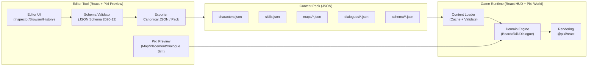
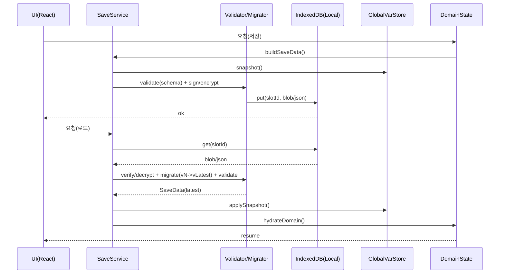
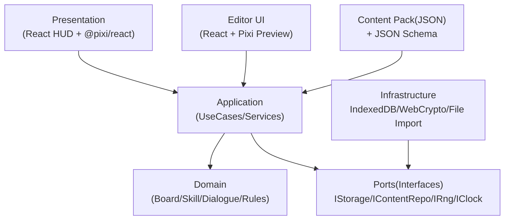
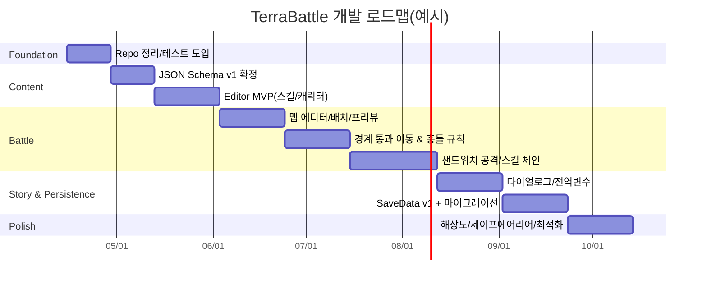

# TerraBattle 개발지침 패키지

## Executive Summary

TerraBattle 저장소는 **Vite + React(TypeScript) + PixiJS(@pixi/react)** 조합으로 “React는 HUD/장면 전환 및 상태, Pixi는 월드 렌더링” 역할을 분리한 **2D 시나리오 기반 격자(그리드) 전술/퍼즐 배틀 프로토타입**입니다. 현재 구현은 **Title 화면까지**이며, 전역 상태는 `useReducer` 기반의 단순한 `GameState`로 시작한 상태입니다. fileciteturn4file0 fileciteturn22file0 fileciteturn23file0 fileciteturn30file0

본 문서는 (A) **AGENTS.md용 개발지침**과 (B) **RoadMap.md(개발단계별 로드맵)**을 한 번에 제공하며, 특히 아래 3개 핵심 요구사항을 “목적 → 요구사항 → 제안 설계(구조도 포함) → 구현 세부사항 → 예제 코드 → 마이그레이션/호환성” 순으로 정리합니다.

- **콘텐츠 제작 툴(생성도구)**: 캐릭터/스킬/맵/다이얼로그 씬을 **일관된 데이터 포맷(JSON + Schema)**으로 제작·검증·미리보기·Import/Export하는 툴 체계를 정의  
- **전역변수 & SaveData**: 런타임 전역변수(플래그/통화/진행도)와 저장데이터를 **버전관리 + 마이그레이션 + 무결성(서명)/선택적 암호화 + 성능(IndexedDB)** 관점에서 설계  
- **Interface + Class 기반 재사용성**: “도메인 규칙(순수 로직) ↔ 표현(React/Pixi)” 레이어 분리를 강화하고, 인터페이스/타입 계약을 중심으로 **테스트 가능한 구조**로 확장

## Repository-derived constraints

다음은 “현재 저장소가 이미 선언한 규칙/구조”로, 이후 설계 제안의 **비호환 리스크를 줄이기 위한 제약조건**입니다.

- **핵심 게임 정의(조작/전투)**: 격자 점유형 전술 배틀이며, 입력 해석은 “타일 경계 통과 기반”, 전투는 드래그 종료 후 **가로/세로 샌드위치로 공격**을 해결하는 방식이 핵심입니다(`docs/core_definition.md`). fileciteturn8file0  
- **UI/해상도 정책**: 기준 해상도는 **1080×1920을 ‘참조 좌표계’로 사용**하고, 앵커/스케일/Min-Max/세이프에어리어를 통해 다양한 화면비에 대응하는 정책이 문서화되어 있습니다(`docs/resolution_rule.md`, `src/shared/constants/display.ts`). fileciteturn9file0 fileciteturn29file0  
- **현재 구현(Title)**: Pixi 배경 스테이지는 가상해상도에 맞춰 fit 스케일로 중앙정렬하며(`TitleLayer.tsx`), 공통 Pixi 캔버스를 유지한 채 React HUD 레이어로 상호작용을 얹고 있습니다(`GameShell.tsx`). fileciteturn26file0 fileciteturn23file0  
- **스킬/성장 규칙 초안**: 스킬은 슬롯/발동확률/효과타입(damage/buff/debuff/heal) 등 최소 스키마가 정의되어 있고(`docs/skill_core_structure.md`), 기본능력치/파생치/명중·데미지 공식 및 성장 방식/EXP 분배가 문서로 존재합니다(`docs/battle_grown_rule.md`). fileciteturn12file0 fileciteturn11file0  
- **코딩 규칙(AGENTS.md)**: “도메인 로직 ↔ 렌더링 로직 분리”, “ESM-only”, “도메인 엔티티/서비스는 class 선호 + 데이터 계약은 interface/type” 등 기본 원칙이 이미 존재합니다(기존 `AGENTS.md`). fileciteturn32file0  
- **테스트 스크립트 불일치**: README에는 `npm test`가 있으나, `package.json`에는 `test` 스크립트가 없습니다(정리 필요). fileciteturn4file0 fileciteturn15file0  

외부 표준/공식 레퍼런스(설계 근거):
- Save/보안 계층에서 WebCrypto의 `encrypt/decrypt/sign/verify`(SubtleCrypto) 사용 가능. citeturn3search1turn3search2turn10search2turn10search0  
- `localStorage`는 **동기(synchronous)** 특성이 있어 대용량 저장/빈번 IO에서 성능 리스크가 있고, IndexedDB는 **비동기**로 대용량 구조화 데이터에 적합. citeturn4search2turn5search0  
- 브라우저 저장소는 **쿼터/축출(eviction)** 정책 영향을 받으므로, “중요 Save”는 `navigator.storage.persist()` 등 정책도 고려 필요. citeturn5search4  
- JSON Schema 2020-12는 구조/검증을 위한 표준 스펙(코어/밸리데이션 분리). citeturn4search0turn4search5  
- 버전 규칙은 SemVer(2.0.0)의 MAJOR/MINOR/PATCH 의미를 참고해, “SaveData/Content Schema” 버전 정책을 명확히 할 수 있음. citeturn3search0  
- PixiJS `Assets`는 Promise 기반 로딩/캐싱을 제공(현 코드의 `Assets.load` 사용과 정합). citeturn6search0  
- `@pixi/react`의 `<Application resizeTo=...>`는 엘리먼트/Ref까지 지원(현 코드의 `resizeTo={window}` 확장 가능). citeturn6search1  
- Vite는 Multi-Page 구성을 통해 “게임 런타임”과 “에디터(툴)”을 분리 빌드하는 전략을 공식적으로 지원. citeturn8search0  
- Vitest는 Vite 기반 프로젝트에 적합한 테스트 러너이며, 기본적으로 `.test.`/`.spec.` 파일 규칙과 `package.json` 스크립트 추가 패턴을 제시. citeturn7search0  

## AGENTS.md

아래 내용은 **본 저장소에서 작업하는 에이전트/개발자가 공통으로 따라야 하는 규칙**입니다. (근거 파일: `AGENTS.md`, `README.md`, `docs/*`, `src/app/*`, `src/game/state/*`) fileciteturn32file0turn4file0turn8file0turn12file0turn23file0turn30file0

### 콘텐츠 제작 툴

**목적**  
캐릭터/스킬/맵/다이얼로그 씬을 “코드 편집 없이”도 제작 가능하게 하되, 런타임에서 안정적으로 로드/검증/마이그레이션되도록 **단일한 콘텐츠 파이프라인**을 구축한다. 특히 현재 저장소가 이미 정의한 규칙(샌드위치 전투, 경계 통과 입력, 스킬 스키마, 성장 공식, 1080×1920 가상해상도)을 툴이 강제·보조하도록 한다. fileciteturn8file0turn12file0turn11file0turn9file0turn29file0

**요구사항**  
- 기능 목록(공통)
  - 목록/검색/필터/태그, 복제, 템플릿 생성, 참조 무결성 검사(“스킬 ID가 존재하는가?”), 변경 diff 미리보기(Export 전), Validation 결과(오류/경고) 표시
  - “Preview” 지원:  
    - 캐릭터: 스탯 계산(파생치, 레벨업 시 증가량) 미리보기  
    - 스킬: 효과 계산(타입/계수/타격수/지속턴) 미리보기  
    - 맵: 그리드 편집 + 타일 속성/장애물 + 스폰/트리거 미리보기  
    - 다이얼로그: 노드 그래프/타임라인 미리보기 + 조건(전역변수) 분기 시뮬레이션
- 데이터 포맷(공통)
  - 파일은 **JSON**(사람이 읽기 쉬운, Git diff-friendly)  
  - 스키마는 **JSON Schema 2020-12**를 기본으로 정의(검증/자동완성/문서화 목적). citeturn4search0turn4search5  
  - 식별자는 안정적인 `id`를 사용(표시명 `name`은 변경 가능), 참조는 `id` 기반(“rename-safe”)
- 에디터 UX(권장 레이아웃)
  - 좌측: 콘텐츠 트리(Characters/Skills/Maps/Dialogues)  
  - 중앙: Pixi 캔버스(맵/배치/미리보기)  
  - 우측: Inspector(선택 요소 속성)  
  - 하단: Validation/Console/History(Undo/Redo)  
  - 상단: Import/Export, Schema 버전, Pack 정보
- Import/Export
  - Import: JSON 단일/다중 파일, “Pack” 형태(여러 JSON 묶음)  
  - Export: JSON 단일/다중, Pack(압축 zip 또는 디렉토리 구조 유지)
  - Export는 **정렬/정규화(canonicalization)** 수행(키 순서/배열 정렬 규칙 고정) → diff 안정화
- 예제 워크플로우(디자이너 관점)
  1) 스킬 템플릿 생성(물리/마법/버프/디버프/힐)  
  2) 캐릭터 생성 → 기본스탯(초기 50 규칙) + 성장방식 선택 + 스킬 슬롯(1번 고정 100%) 지정  
  3) 맵 생성 → 그리드 크기/타일 속성/장애물/스폰 지정  
  4) 다이얼로그 생성 → “스테이지 시작/승리/패배/특정 트리거”에 연결  
  5) Pack Export → 게임 런타임에서 로드/검증 → 플레이테스트

**제안 설계**  
핵심은 “**Content Pack**”이라는 단위로 모든 콘텐츠를 묶고, 런타임/툴이 동일한 스키마·로더를 공유하는 것이다.

- 권장 디렉토리(예시)
  - `src/content/schema/*` : JSON Schema(캐릭터/스킬/맵/다이얼로그/SaveData)  
  - `src/content/packs/dev/*` : 개발용 Pack(JSON)  
  - `src/content/runtime/*` : 로더/캐시/검증기(런타임과 툴이 공유)  
  - `src/tools/editor/*` : 에디터 UI(React) + Pixi Preview
- “툴 분리” 옵션(비교)

| 옵션 | 장점 | 단점 | 권장도 |
|---|---|---|---|
| 게임 앱 내부 라우트(`/editor`) | 빌드 단순, 코드 공유 쉬움 | 런타임 번들 비대화, 권한(파일 저장) UX 혼재 | 중 |
| **Vite Multi-Page(별도 `editor/index.html`)** | 런타임/툴 번들 분리, 배포 분리 가능 | 설정/엔트리 관리 필요 | **상** |
| CLI(노드 스크립트)만 제공 | Git 친화적, 자동화 쉬움 | UX 부족(디자이너 장벽) | 낮 |

Vite는 멀티 페이지 엔트리를 공식 지원하므로 “게임=main, 에디터=editor”로 분리하는 전략을 1순위로 권장한다. citeturn8search0  

- 구조도(툴/런타임/데이터)



**구현 세부사항**  
- 스킬 데이터는 기존 문서의 최소 스키마를 “툴에서 직접 입력하는 형태”로 고정한다(`docs/skill_core_structure.md`). 특히 `source_stat` vs `affected_stat`, 슬롯 발동 순서 규칙을 에디터가 UI로 가시화한다. fileciteturn12file0  
- 성장/스탯 계산은 문서의 공식(파생치, 명중률, 데미지, EXP 분배)을 “테스트 가능한 순수 함수”로 추출하고, 에디터의 Preview가 이를 호출하도록 한다(`docs/battle_grown_rule.md`). fileciteturn11file0  
- 맵 에디터는 “격자 점유형 + 경계 통과 기반 조작”을 반영해야 하므로, 타일 경계/점유/충돌(ally swap, block) 모델을 먼저 구현하고(`docs/core_definition.md`), 그 위에 UI를 얹는다. fileciteturn8file0  
- Pixi의 리소스 로딩은 `Assets` 중심으로 정리한다(현재 `TitleLayer.tsx`가 `Assets.load`를 사용). 이는 캐싱/중복로드 안전성을 제공하므로, 에디터에서도 동일 패턴을 유지한다. fileciteturn26file0 citeturn6search0  
- 가상해상도/스케일 정책은 `VIRTUAL_WIDTH/HEIGHT`(1080×1920) 기준을 유지하되, 에디터의 맵 캔버스는 “fit / fill / 1:1” 모드 토글을 제공한다(`docs/resolution_rule.md`, `src/shared/constants/display.ts`). fileciteturn9file0turn29file0  

**예제 코드 스니펫(TypeScript)**  
콘텐츠 로더/검증기 인터페이스(런타임·툴 공유)의 최소 형태:

```ts
// src/content/runtime/ContentRepository.types.ts
export type ContentId = string;

export interface ContentPackMeta {
  readonly packId: string;        // 예: "dev"
  readonly schemaVersion: string; // 예: "2020-12" or 내부 규약 버전
  readonly createdAt: string;     // ISO-8601
  readonly updatedAt: string;     // ISO-8601
}

export interface ContentPack {
  readonly meta: ContentPackMeta;
  readonly skills: readonly SkillDef[];
  readonly characters: readonly CharacterDef[];
  readonly maps: readonly MapDef[];
  readonly dialogues: readonly DialogueSceneDef[];
}

export interface IContentRepository {
  loadPack(packId: string): Promise<ContentPack>;
}

export interface IContentValidator {
  validatePack(pack: unknown): { ok: true } | { ok: false; errors: readonly string[] };
}
```

**마이그레이션/호환성 고려사항**  
- “툴 버전”과 “콘텐츠 스키마 버전”을 분리한다.  
  - 툴은 빠르게 개선되지만, 콘텐츠는 누적 자산이므로 스키마 변화는 엄격히 관리해야 한다(SemVer 요지 참고). citeturn3search0  
- 스키마 변경은 반드시 “마이그레이션 함수”와 “이전 버전 Import 호환”을 함께 제공한다.  
- ID 정책: `id`는 불변(immutable), 표시명만 변경 가능하도록 강제(참조 안정성).  
- Export 정규화 규칙이 바뀌면 diff가 커질 수 있으므로, 정규화 규칙은 “Major”로 취급한다(스키마/툴 릴리스 노트에 기록).

### 전역변수 및 SaveData

**목적**  
(1) 다이얼로그 분기/트리거/보상 등에서 사용할 **전역변수(Global Variables)**를 일관되게 관리하고, (2) 세이브/로드가 가능한 **SaveData**를 정의하여, 향후 규칙/콘텐츠 확장에도 깨지지 않는 **버전/마이그레이션/무결성** 체계를 마련한다. 현재 전역 상태는 `GameState(scene/turn/selectedUnitId/modal)` 수준이므로, 런타임 상태/저장 상태를 명확히 분리하는 것이 첫 과제다. fileciteturn31file0turn30file0

**요구사항**  
- 전역변수 관리
  - 네임스페이스 기반 키(예: `flags.chapter1.cleared`, `player.currency.gold`)  
  - 타입 안정성: “정의된 키만 사용” + 값 타입 일치  
  - 기본값/리셋 규칙: 새 게임 시 초기화 규칙 명시  
  - 이벤트/구독(옵저버): UI/다이얼로그/트리거가 반응 가능
- SaveData
  - 버전 관리: `saveVersion`(정수) 또는 `schemaVersion`(SemVer) 필수  
  - 마이그레이션: `vN -> vN+1` 단계적 변환 함수 체인  
  - 보안:
    - (필수) **무결성(서명)**: 저장값 변조 탐지(HMAC 등)  
    - (선택) **암호화(AES-GCM)**: 즉시 노출 방지(클라이언트 한계는 명시)  
    - WebCrypto는 HTTPS secure context에서 사용 가능(브라우저 제약). citeturn3search1turn10search2turn10search0  
  - 성능:
    - `localStorage`는 동기 IO라 대용량/빈번 저장에 부적합(프레임 드랍 위험). citeturn4search2  
    - IndexedDB는 비동기 + 대용량 구조화 데이터에 적합. citeturn5search0  
    - 저장소 쿼터/축출 정책 리스크를 고려(중요 세이브는 persistence 요청 고려). citeturn5search4  
  - 샘플 JSON/JSON Schema 제공(툴/런타임 공용)

**제안 설계**  
- 상태 분리 원칙
  - `GameState`(UI 라우팅/모달/선택 등 “현재 화면 상태”)는 **저장 대상에서 제외**  
  - `SaveData`는 “플레이 진척/전역변수/파티/인벤토리/클리어 기록”만 포함  
  - 런타임 전투 중인 “BattleRuntimeState”는 재현성(시드/리플레이) 요구가 없다면 기본적으로 Save에 넣지 않고, 체크포인트 단위로만 저장
- 저장 파이프라인(권장)
  1) `SaveData` 생성(도메인 상태 + 전역변수 스냅샷)  
  2) JSON 직렬화(정규화)  
  3) (선택) 압축  
  4) (필수) 서명(HMAC) 저장  
  5) (선택) 암호화(AES-GCM)  
  6) IndexedDB에 저장
- 구조도(저장/로드)



**구현 세부사항**  
- 저장소 선택
  - **기본: IndexedDB**(비동기, 대용량) citeturn5search0turn5search1  
  - 보조: localStorage(설정값/소형 옵션만). localStorage는 동기이므로, 큰 SaveData 저장은 금지한다. citeturn4search2  
- 무결성/암호화
  - 서명(HMAC): `SubtleCrypto.sign/verify`로 구현 가능(알고리즘 `"HMAC"`). citeturn10search2turn10search0  
  - 암호화(AES-GCM): `SubtleCrypto.encrypt/decrypt` 활용. citeturn3search1turn3search2  
  - 주의: 클라이언트 단독 게임에서 “완전한 치트 방지”는 불가. 목표는 **실수/캐주얼 변조 방지 + 데이터 손상 탐지**로 한정
- 스키마/마이그레이션
  - SaveData는 JSON Schema로 검증(로드 시점에 강제) citeturn4search0turn4search4  
  - `migrations: Record<number, (old) => new>` 형태의 체인 구성(스텝별 테스트 필수)

**샘플 SaveData JSON(요약)**  
(예: 최소 구조. 실제 필드는 게임 진행에 맞춰 확장)

```json
{
  "saveVersion": 1,
  "meta": {
    "slotId": "slot-1",
    "createdAt": "2026-04-15T12:00:00.000Z",
    "updatedAt": "2026-04-15T12:34:56.000Z"
  },
  "global": {
    "flags": {
      "chapter1Cleared": false
    },
    "currency": {
      "gold": 120
    }
  },
  "party": {
    "unitIds": ["char_001", "char_002", "char_003"]
  },
  "inventory": {
    "items": [
      { "id": "item_potion", "qty": 3 }
    ]
  },
  "progress": {
    "currentStageId": "stage_001",
    "clearedStages": []
  }
}
```

**샘플 JSON Schema(핵심만 발췌, 2020-12 기반)** citeturn4search0turn4search5  
(실제 파일은 `src/content/schema/save.schema.json` 등으로 분리 권장)

```json
{
  "$schema": "https://json-schema.org/draft/2020-12/schema",
  "type": "object",
  "required": ["saveVersion", "meta", "global", "party", "inventory", "progress"],
  "properties": {
    "saveVersion": { "type": "integer", "minimum": 1 },
    "meta": {
      "type": "object",
      "required": ["slotId", "createdAt", "updatedAt"],
      "properties": {
        "slotId": { "type": "string" },
        "createdAt": { "type": "string" },
        "updatedAt": { "type": "string" }
      },
      "additionalProperties": false
    }
  },
  "additionalProperties": false
}
```

**예제 코드 스니펫(Python: 세이브 마이그레이션 CLI 예시)**  
(로컬에서 세이브 파일을 일괄 변환/검증할 때 유용)

```python
# tools/migrate_save.py
import json
from typing import Any, Dict

LATEST = 2

def migrate_v1_to_v2(old: Dict[str, Any]) -> Dict[str, Any]:
    # 예: flags 구조 변경
    new = dict(old)
    new["saveVersion"] = 2
    flags = new.get("global", {}).get("flags", {})
    # v2에서 chapter 클리어 플래그 키 변경
    if "chapter1Cleared" in flags:
        flags["story.chapter1.cleared"] = bool(flags.pop("chapter1Cleared"))
    return new

MIGRATIONS = {
    1: migrate_v1_to_v2,
}

def migrate(save: Dict[str, Any]) -> Dict[str, Any]:
    v = int(save.get("saveVersion", 0))
    while v < LATEST:
        if v not in MIGRATIONS:
            raise RuntimeError(f"Missing migration for v{v} -> v{v+1}")
        save = MIGRATIONS[v](save)
        v = int(save["saveVersion"])
    return save

if __name__ == "__main__":
    import sys
    path = sys.argv[1]
    with open(path, "r", encoding="utf-8") as f:
        data = json.load(f)
    out = migrate(data)
    print(json.dumps(out, ensure_ascii=False, indent=2))
```

**마이그레이션/호환성 고려사항**  
- 세이브 로드 시나리오별 정책
  - “서명 실패”: 사용자에게 “손상/변조 가능성” 경고 + 복구 옵션(백업/이전 슬롯)  
  - “마이그레이션 실패”: 구버전 백업 유지 + 오류 리포트(콘솔/로그)  
- 브라우저 저장소 정책
  - 저장소 쿼터/축출로 Save가 사라질 수 있으므로, 중요한 세이브는 “Export to file” 기능 제공 권장(사용자 백업). citeturn5search4  
- WebCrypto는 HTTPS secure context 요구가 있으므로, 배포 환경(로컬/스테이징/프로덕션)별 동작 차이를 문서화한다. citeturn3search1turn10search2  

### 재사용 아키텍처 및 테스트

**목적**  
현재 프로젝트 원칙(“도메인 로직과 렌더링 로직을 섞지 않는다”, “도메인 엔티티/서비스는 class 선호”, “데이터 계약은 interface/type”)을 확장하여,  
- 전투/맵/스킬/다이얼로그/세이브를 **서로 독립적으로 테스트 및 재사용** 가능하게 하고  
- 에디터(툴)와 런타임(게임)이 **동일한 도메인/로더/스키마**를 공유하도록 만든다. fileciteturn32file0  

**요구사항**  
- Interface 중심 설계
  - 인프라(저장소/네트워크/시간/난수)는 반드시 인터페이스로 추상화 → 도메인은 순수 로직 유지
- Class 기반 도메인
  - `Board`, `Unit`, `SkillRuntime`, `DialogueRunner` 등은 class로 캡슐화(불변식/메서드 포함)
- 상속/조합 전략
  - 기본은 **조합(Composition)**, 상속은 “명확한 is-a + 다형성 필요 + 테스트 이점”이 있을 때만
- 테스트 전략
  - 도메인 유닛 테스트(규칙/계산/전투 해결)  
  - 마이그레이션 테스트(각 버전 변환)  
  - 콘텐츠 검증 테스트(JSON Schema + 참조 무결성)  
  - 렌더링 스모크 테스트(최소)
- 툴과 런타임의 경계
  - 에디터에서만 필요한 UI/상태는 `src/tools/*`로 격리  
  - 도메인/콘텐츠 로더는 `src/game/*` 및 `src/content/*`로 공용화

**제안 설계**  
- 권장 레이어링(의존 방향 단방향)



- Type/Interface 설계 가이드(핵심 패턴)
  - “입력 2개 이상이면 object parameter” 규칙은 기존 AGENTS.md와 동일하게 유지(`GameShellProps` 같은 방식). fileciteturn32file0turn23file0  
  - 액션/이벤트는 문자열 union으로 제한(예: `GameStateAction` 패턴 유지). fileciteturn31file0  

**구현 세부사항**  
- 전투 규칙(경계 통과/스왑/블럭/샌드위치)은 도메인 레이어에서 “입력 이벤트 → 상태 변환”으로 구현한다. UI(Pixi 드래그)는 “연속 이동처럼 보이는” 표현만 담당하고, 경계 통과 시점에만 도메인 이벤트를 발생시킨다(문서의 정의를 그대로 구현). fileciteturn8file0  
- `@pixi/react`의 `<Application resizeTo={window}>` 패턴은 유지하되, 향후엔 `resizeTo`를 컨테이너 ref로 바꿔 HUD/툴 캔버스 분리도 지원 가능(공식 문서에서 resizeTo가 element/ref를 지원). fileciteturn23file0 citeturn6search1  
- 테스트 도입
  - 현재 `package.json`에 `test` 스크립트가 없으므로, Vitest를 도입해 README와 스크립트를 정합시키는 것을 1차 작업으로 권장. Vitest는 Vite 설정을 재사용 가능하고 `.test.`/`.spec.` 규칙, `package.json` 스크립트 추가 패턴을 제공한다. fileciteturn15file0turn4file0 citeturn7search0  

**예제 코드 스니펫(TypeScript: Port/Service/Domain 분리 예시)**

```ts
// src/game/ports/IStorage.ts
export interface IStorage {
  get(key: string): Promise<string | null>;
  set(key: string, value: string): Promise<void>;
  delete(key: string): Promise<void>;
}

// src/game/save/SaveService.ts
import type { IStorage } from "../ports/IStorage.js";
import type { SaveData } from "./SaveData.types.js";

export class SaveService {
  public constructor(
    private readonly storage: IStorage,
    private readonly serializer: SaveSerializer,
  ) {}

  public async save(slotId: string, data: SaveData): Promise<void> {
    const payload = await this.serializer.serialize(data); // validate + sign (+ encrypt)
    await this.storage.set(`save:${slotId}`, payload);
  }

  public async load(slotId: string): Promise<SaveData | null> {
    const payload = await this.storage.get(`save:${slotId}`);
    if (payload === null) return null;
    return this.serializer.deserialize(payload); // verify + decrypt + migrate + validate
  }
}
```

**마이그레이션/호환성 고려사항**  
- 도메인 규칙 변경(예: 샌드위치 판정 범위 확장)은 “콘텐츠/세이브”와 직결될 수 있으므로,  
  - 규칙 변경 시 반드시 “리플레이/세이브 호환 여부” 체크리스트를 통과해야 한다.  
- 테스트는 “버전별 골든 데이터”를 유지한다(특정 SaveData v1 샘플로 로드가 성공해야 한다).  
- 문서(`docs/*`)는 규칙의 단일 진실원(single source of truth)로 취급하고, 코드와 어긋나면 문서/코드 중 무엇을 맞출지 PR에서 명시한다. fileciteturn8file0turn11file0turn12file0turn9file0  

## RoadMap.md

### 단계별 개발 로드맵

아래 로드맵은 “현재 Title 화면까지만 구현”인 상태에서 시작하며(README 기준), **콘텐츠 제작 툴 → 전투 루프 → 다이얼로그/전역변수 → SaveData** 순으로 리스크를 낮추는 구성을 권장합니다. fileciteturn4file0turn23file0turn30file0

**Phase/Milestone 요약(노력 추정: low/med/high)**

| Phase | 핵심 목표 | 마일스톤(완료 기준) | 추정 노력 | 주요 산출물 | 주요 리스크 |
|---|---|---|---|---|---|
| Foundation | “규칙/구조/테스트 도입” 기반 정리 | README↔scripts 정합, Vitest 도입, 기본 폴더 구조 확정 | low~med | `test` 스크립트, 최소 도메인 테스트 5개, 폴더 스캐폴딩 | 초기 설계 과도(오버엔지니어링) |
| Content Schema | 콘텐츠 스키마/검증기 확립 | Skill/Character/Map/Dialogue Schema v1 확정 | med | JSON Schema 파일, validator, 예제 Pack | 스키마 확정 지연 |
| Tool MVP | 에디터 최소 기능 | Skill/Character 편집+검증+Export 가능 | med | Editor UI(MVP), Import/Export, Preview 일부 | UX 복잡도 급증 |
| Map & Battle Skeleton | 맵/전투 씬 골격 | 그리드 렌더 + 배치 + 경계 통과 이동(move/swap/block) | high | Board 엔진, BattleScene(임시) | 입력/렌더 동기화 버그 |
| Combat & Skill | 전투 해결/스킬 체인 | 샌드위치 공격 + 스킬 슬롯 발동 + 피해/버프 반영 | high | BattleResolver, SkillRuntime, 계산 테스트 | 밸런스/규칙 변경 잦음 |
| Dialogue & Globals | 다이얼로그/전역변수 | 노드 기반 대화 + 조건 분기 + 트리거 연동 | med~high | DialogueRunner, GlobalVarStore, 에디터 확장 | 스크립트 요구 증가 |
| SaveData v1 | 저장/로드/마이그레이션 | IndexedDB 저장, v1->v2 마이그레이션 테스트 | med | SaveService, storage adapter, schema, migrations | 브라우저 정책/축출 |
| Polish | 성능/안정화/가이드 | 해상도 정책/세이프에어리어/리소스 번들 최적화 | med | 성능 측정, UX 개선, 문서 업데이트 | 범위 확장(끝없는 폴리싱) |

**단계별 타임라인(예시, 주 단위)**  
(실제 일정은 팀 규모/우선순위에 따라 조정)



**구현 우선순위(리스크 기반)**  
- “툴/스키마”를 먼저 고정하면, 이후 전투/다이얼로그/세이브가 **데이터 계약 위에서 병렬 개발** 가능  
- SaveData는 너무 일찍 만들면 “도메인 변경”에 끌려 다니므로, **도메인/콘텐츠 계약이 v1으로 안정화되는 시점**에 착수  
- 브라우저 저장소는 쿼터/축출 리스크가 있으므로(특히 Safari 정책 등), “Export/Import 백업” 기능을 RoadMap에 포함 citeturn5search4  

**필수 정합 작업 체크리스트(초기 Phase에서 고정)**  
- README의 `npm test`와 `package.json` scripts 정합(현재 불일치). fileciteturn4file0turn15file0  
- Vite 기반 테스트 러너 도입 시, 프로젝트의 Vite 버전과 요구 Node 버전 확인(Vitest 가이드 참고). citeturn7search0  
- Pixi 리소스 로딩은 `Assets` 중심으로 표준화(현재 코드 패턴 유지). fileciteturn26file0 citeturn6search0  
- 에디터 분리는 Vite Multi-Page로 구현 가능(공식 가이드 근거). citeturn8search0
