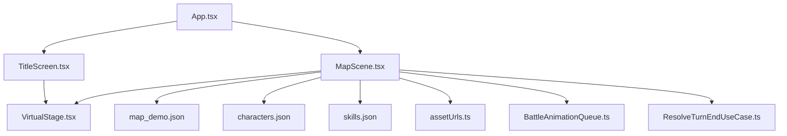
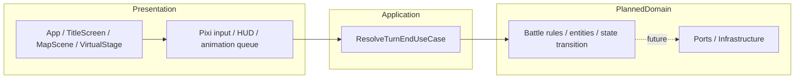
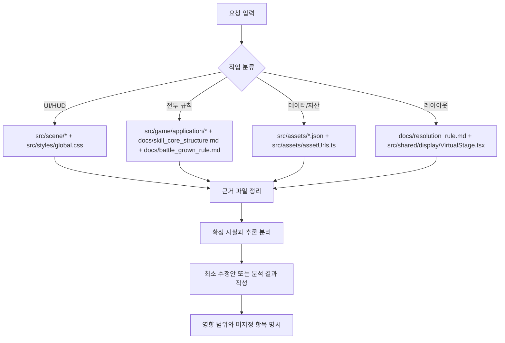

# TerraBattle 맞춤 Agents.md와 Prompt.md 완료보고서

## 핵심 요약

이 보고서는 

TerraBattle의 현재 방향성은 문서 기준으로는 “경계 통과 기반 조작을 사용하는 격자 점유형 전술 배틀”이며, 코드와 최근 커밋 기준으로는 이미 `Title` 화면만이 아니라 `title -> map` 전환, Pixi 기반 타일 드래그와 스왑, 드래그 제한 시간 HUD, 턴 종료 시 샌드위치 공격 해결, 스킬명/피해 텍스트/샌드위치 연출 큐까지 진행된 상태다. 따라서 새 `Agents.md`는 “게임 장르나 시스템 축을 바꾸지 않고, 현재의 맵-전투 루프를 확장하는 코딩 가이드”여야 하고, 새 `Prompt.md`는 “README의 개요와 현재 코드/최근 커밋의 차이를 구분해서 읽는 협업 프롬프트”여야 한다. 

이 저장소에는 한 가지 중요한 판독 규칙이 필요하다. `README.md`는 아직 “현재 구현 범위는 Title 화면까지”라고 적고 있지만, 실제 `src/app/App.tsx`, `src/scene/map/MapScene.tsx`, `src/game/application/ResolveTurnEndUseCase.ts`, `src/scene/map/BattleAnimationQueue.ts`는 그보다 훨씬 진전된 상태를 보여준다. 또한 `docs/resolution_rule.md`는 1080x1920 참조 해상도를 말하지만, 현재 런타임의 `src/shared/display/VirtualStage.tsx`와 `src/styles/global.css`는 1200x1920 가상 스테이지를 사용한다. 따라서 두 문서 모두 “현재 동작은 코드와 최근 커밋을 우선, 설계 의도는 문서를 참고, 충돌은 조용히 덮지 말고 명시”라는 원칙을 중심으로 설계되어야 한다. 

## 저장소 판독

이번 검토에서 현재 상태를 판독할 때는 `README.md`를 개요의 출발점으로만 사용하고, 실제 동작은 `src/`와 최근 커밋을 우선 근거로 삼았다. 열린 이슈와 PR 맥락은 이번 연결 조회에서 신뢰할 만한 근거로 확보되지 않았기 때문에, 아래 제안서는 README, 설계 문서, 현재 소스, 최근 커밋만을 근거로 작성했다.

현재 앱의 엔트리는 `index.html -> src/main.ts -> src/app/App.tsx`로 이어지고, `App.tsx`는 단순한 로컬 상태로 `title`과 `map` 두 씬을 전환한다. `TitleScreen.tsx`는 시작 버튼과 `VirtualStage`를 이용한 첫 화면을 담당하고, `MapScene.tsx`는 JSON 기반 맵 데이터/캐릭터/스킬을 읽어 Pixi 타일 레이어, HUD, 드래그 처리, 연출 재생을 묶는다. 즉, 현재 저장소는 라우터나 전역 상태 프레임워크를 전제로 하지 않는 “작은 프로토타입 + 명시적 파일 책임” 구조다. 

전투 규칙과 데이터 계약도 이미 꽤 구체적이다. `docs/core_definition.md`는 “경계 통과 기반 조작”과 “샌드위치 공격”을 게임 정체성으로 고정하고, `docs/skill_core_structure.md`는 스킬 필드와 슬롯 해결 순서를 정의하며, `docs/battle_grown_rule.md`는 기본 능력치, 파생치, 명중률, 데미지, 성장 방식을 명시한다. `ResolveTurnEndUseCase.ts`와 그 테스트 파일은 이 규칙을 코드로 옮긴 현재의 핵심 로직이므로, 이 영역을 건드리는 협업은 반드시 문서와 코드 양쪽을 함께 읽어야 한다. 

코딩 규약은 기존 `AGENTS.md`와 실제 코드 패턴이 비교적 잘 맞아 있다. 저장소는 TypeScript + ESM + named export를 사용하고, React UI는 함수 컴포넌트, 유스케이스/오케스트레이션 로직은 class, 데이터 계약은 interface/type, 공개 함수와 메서드는 명시적 반환 타입, 한국어 TSDoc, `readonly` 중심의 계약을 선호한다. 패키지 매니페스트는 `type: "module"`과 React/Pixi/Vite/Vitest 구성을 보여 주고, `tsconfig.json`은 strict TypeScript 기반이다. 즉, 새 `Agents.md`는 기존 규칙을 덮어쓰는 문서가 아니라, 이 패턴을 `MapScene`, `ResolveTurnEndUseCase`, JSON 계약, 연출 큐로 더 선명하게 연결하는 문서가 되어야 한다. 

최근 커밋 흐름도 같은 결론을 뒷받침한다. 2026-04-16의 커밋은 `title -> map` 플로우와 Pixi 타일 드래깅을 붙였고, 같은 날 드래그 타이머 HUD를 추가했으며, 2026-04-17에는 턴 종료 샌드위치 공격 해결과 그 다음 단계인 `swap destination` 계산 보정을 넣었다. 즉, 현 시점의 TerraBattle은 “콘텐츠 툴”보다 “맵 입력과 턴 종료 전투 해결을 안정화하는 런타임”에 무게가 실려 있다. `Prompt.md`는 이 맥락을 현재 상태 요약의 첫 줄에 반영해야 한다. 

## Agents.md

다음 본문은 루트 `AGENTS.md`에 들어가야 할 권장안이다. 설계 철학은 “현재 TerraBattle의 진행 방향을 고정하고, 파일별 책임과 계약을 명확하게 해 Codex가 과잉 재설계하지 않도록 만드는 것”이다. OpenAI의 `AGENTS.md` 가이드가 루트 저장소 규약을 먼저 두고, 필요할 때만 더 가까운 경로에서 override 하라고 권장하므로, 현재 저장소 크기에서는 루트 한 장으로 충분하고, 나중에 `src/tools/` 또는 `editor/`가 독립 모듈로 실체화될 때만 하위 override를 추가하는 편이 적합하다. 

**문서 목적**  
이 저장소의 `AGENTS.md`는 TerraBattle에서 코드를 작성하거나 수정할 때 따라야 하는 저장소 전용 코딩 가이드다. 이 문서는 “무엇을 만들 것인가”보다 “어디에, 어떤 책임으로, 어떤 계약을 깨지 않고 구현할 것인가”를 고정한다. TerraBattle는 현재 `title -> map -> drag/swap -> turn-end sandwich resolution` 축을 중심으로 확장되고 있으므로, 새 코드는 이 루프를 보강하거나 분리하는 방향으로만 제안한다. 

**프로젝트 방향 고정**  
TerraBattle의 게임 정의는 `docs/core_definition.md`에 적힌 “경계 통과 기반 조작을 사용하는 격자 점유형 전술 배틀”이다. 샌드위치 공격, 격자 점유, 최종 보드 상태 기준 해결은 선택 옵션이 아니라 현재 설계 축이다. 따라서 이 저장소에서 에이전트는 액션 RPG식 직접 공격, 자유 배치형 실시간 월드, 임의의 UI 프레임워크 전환, 라우터/상태관리 라이브러리 전면 교체를 기본 가정으로 두지 않는다. 그런 변화는 별도 명시 요청이 있을 때만 제한적으로 제안한다. 

**진실원 우선순위**  
현재 동작 판정은 `src/` 코드를 먼저 본다. 규칙과 의도는 `docs/core_definition.md`, `docs/skill_core_structure.md`, `docs/battle_grown_rule.md`, `docs/architecture.md`, `docs/resolution_rule.md`를 본다. 개요 수준 설명은 `README.md`를 본다. 최근성은 커밋을 참고한다. 이 우선순위가 필요한 이유는 README와 설계 문서 일부가 현재 구현보다 뒤처지거나, 반대로 설계 의도를 앞서가고 있기 때문이다. 예를 들어 `docs/resolution_rule.md`는 1080x1920 참조 해상도를 말하지만, 현재 런타임은 `src/shared/display/VirtualStage.tsx`와 `src/styles/global.css`에서 1200x1920 가상 스테이지를 사용한다. 이런 불일치를 발견하면 조용히 “정상화”하지 말고, 현재 런타임을 유지한 채 차이를 명시한다. 

**파일별 책임 표**

| 경로 | 이 파일이 책임지는 것 | 여기 두면 안 되는 것 |
|---|---|---|
| `src/app/App.tsx` | 상위 씬 전환과 앱 수준의 최소 상태 | 전투 수식, JSON 계약 파싱 로직 |
| `src/scene/title/TitleScreen.tsx` | 타이틀 화면 UI와 시작 액션 연결 | 맵 데이터, 전투 계산 |
| `src/scene/map/MapScene.tsx` | 맵 씬의 입력 연결, Pixi 레이어, HUD, 연출 상태 조립 | 장기 유지할 전투 수식과 데이터 규칙의 원본 정의 |
| `src/scene/map/BattleAnimationQueue.ts` | 화면 연출 순서와 타이밍 큐 | 실제 데미지 계산식, 캐릭터 성장 규칙 |
| `src/game/application/ResolveTurnEndUseCase.ts` | 턴 종료 전투 해결, 샌드위치 공격 처리, 피해/턴 결과 계산 | React 상태나 DOM/Pixi 렌더링 세부 구현 |
| `src/assets/*.json` | 맵/캐릭터/스킬의 런타임 입력 데이터 | 자바스크립트 로직, 계산 함수 |
| `src/assets/assetUrls.ts` | JSON 경로를 번들 URL로 정규화하고 조회하는 어댑터 | 게임 규칙, 씬 상태 |
| `src/shared/display/VirtualStage.tsx` | 공용 가상 좌표계와 씬 래핑 | 맵 규칙, 전투 규칙 |

이 표의 분리는 현재 소스 구조와 `docs/architecture.md`의 Presentation/Application 분리 원칙을 직접 반영한다. 문서상으로는 더 완전한 `domain/ports/infrastructure` 레이어가 예고되어 있지만, 현재 코드에서 직접 확인되는 핵심 경계는 위 표 수준이다. 새 코드는 이 경계를 더 뚜렷하게 만드는 방향으로만 이동한다. 

**코딩 규칙**  
새 코드는 TypeScript, ESM, named export를 기본으로 하고, 로컬 타입스크립트 import도 현재 저장소처럼 `.js` 확장자를 유지한다. React UI는 함수 컴포넌트와 `Props` 타입을 쓰고, 유스케이스와 로직 오케스트레이션은 class 기반으로 둔다. 공개 함수와 메서드는 반환 타입을 명시하고, 다수 필드를 가진 입력과 출력은 interface 또는 type으로 계약을 만든다. 계약과 상태 객체는 `readonly`를 기본으로 사용하고, React 쪽의 상태 갱신은 현재 코드처럼 불변 업데이트를 유지한다. 주석과 TSDoc는 한국어를 유지하되, 식별자와 파일명은 현재처럼 영어 중심으로 둔다. 

**데이터와 계약 규칙**  
맵 데이터는 현재 `src/assets/map_demo.json`에 맞춰 최소한 `background`, `rows`, `cols`, `timer`, `cells`를 유지한다. 스킬 데이터는 `docs/skill_core_structure.md`의 필드와 슬롯 해결 순서를 거스르지 않아야 하며, 캐릭터 데이터는 현재 `src/assets/characters.json`이 보여 주는 `image_path`, 타일 crop 좌표, 기본 스탯, `skill_slots`, 성장 계열 필드를 보존하는 방향으로 바꿔야 한다. JSON 안의 자산 경로는 문자열로 저장하고, 런타임에서는 반드시 `src/assets/assetUrls.ts`를 통해 URL로 변환한다. 전투 수식이나 턴 종료 규칙을 바꿀 때는 `docs/battle_grown_rule.md`, `docs/skill_core_structure.md`, `src/game/application/ResolveTurnEndUseCase.ts`를 함께 갱신 대상으로 본다. 

**구현 예시**  
유스케이스 추가는 현재 `ResolveTurnEndUseCase.ts` 패턴처럼 class + 명시적 입력/출력 계약으로 둔다. 예를 들면 다음 형태가 적합하다.

```ts
// src/game/application/ResolveBuffTickUseCase.ts
export interface ResolveBuffTickInput {
  readonly characters: readonly BattleCharacter[];
  readonly turnCount: number;
}

export interface ResolveBuffTickOutput {
  readonly nextCharacters: readonly BattleCharacter[];
}

export class ResolveBuffTickUseCase {
  public execute(input: ResolveBuffTickInput): ResolveBuffTickOutput {
    return {
      nextCharacters: input.characters,
    };
  }
}
```

UI 분리는 현재 `TitleScreen.tsx`와 `MapScene.tsx` 패턴처럼 함수 컴포넌트 + `Props` 타입으로 둔다. 예를 들면 다음 형태가 현재 저장소 문법과 가장 잘 맞는다.

```tsx
// src/scene/map/TurnCounterHud.tsx
interface TurnCounterHudProps {
  readonly turnCount: number;
}

export function TurnCounterHud(
  props: TurnCounterHudProps,
): React.ReactElement {
  return (
    <div className="map-scene__turn-counter">
      {props.turnCount}
    </div>
  );
}
```

이 예시는 기존 저장소가 React 쪽에서는 함수 컴포넌트, 애플리케이션 로직 쪽에서는 class, 스타일 네이밍에서는 `map-scene__*` 패턴을 쓰고 있다는 사실을 그대로 따른다. 

**금지되는 변경 패턴**  
React 컴포넌트 안으로 전투 수식과 슬롯 해결 규칙을 다시 넣지 않는다. `src/assets/*.json`의 계약을 바꾸면서 `assetUrls.ts`와 사용처를 같이 갱신하지 않는 변경을 하지 않는다. 해상도 관련 문서와 런타임 상수의 불일치를 발견해도, 별도 요구가 없으면 임의로 1080 체계나 1200 체계 가운데 하나로 통일하지 않는다. README가 뒤처졌다고 해서 현재 코드의 씬 플로우를 README 수준으로 되돌리는 제안도 하지 않는다. 

## Prompt.md

다음 본문은 TerraBattle 협업용 `Prompt.md` 권장안이다. 설계 핵심은 OpenAI 가이드가 강조하는 블록 구조, 명시적 출력 형식, 근거 고정, 의존성 있는 단계의 순차 실행, 그리고 완료 조건의 명문화를 그대로 가져오되, TerraBattle의 실제 파일 경계와 현재 구현 상태에 맞춰 내용을 좁히는 것이다. 특히 이 저장소는 README와 런타임의 차이가 있기 때문에, 프롬프트 안에 “현재 상태 요약”과 “소스 우선순위”를 반드시 넣는 편이 효과적이다. 

**문서 목적**  
이 문서는 TerraBattle 저장소와 협업할 때 모델에게 먼저 제공하는 저장소 설명서다. 모델은 이 문서를 읽고, 현재 구현을 기준으로 작업 범위를 파악하고, 필요한 파일만 좁혀 보고, 확정 사실과 추론을 분리해서 답해야 한다.

**현재 상태 요약**  
TerraBattle는 README 기준으로는 “Title 화면까지 구현된 Vite + React + TypeScript + PixiJS 부트스트랩”이지만, 현재 코드와 최근 커밋 기준으로는 `title -> map` 씬 전환, Pixi 타일 드래그와 스왑, 맵 데이터의 드래그 시간 제한, 턴 종료 샌드위치 공격 해결, 스킬명/샌드위치/피해 텍스트 연출 큐까지 포함한 프로토타입이다. 또한 전투 규칙은 `docs/skill_core_structure.md`와 `docs/battle_grown_rule.md`가 이미 구체화하고 있고, 최소 검증 범위의 테스트도 `src/game/application/ResolveTurnEndUseCase.test.ts`에 존재한다. 열린 이슈/PR 정보가 제공되지 않으면, 현재 상태 판단은 README보다 `src/`와 최근 커밋을 우선한다. 

**협업 시 소스 우선순위**  
모델은 현재 동작을 판단할 때 `src/app/App.tsx`, `src/scene/map/MapScene.tsx`, `src/scene/map/BattleAnimationQueue.ts`, `src/game/application/ResolveTurnEndUseCase.ts`, `src/shared/display/VirtualStage.tsx`를 먼저 본다. 규칙과 설계 의도는 `docs/core_definition.md`, `docs/skill_core_structure.md`, `docs/battle_grown_rule.md`, `docs/architecture.md`, `docs/resolution_rule.md`를 본다. 저장소 개요는 `README.md`, 가장 최근 방향성은 최근 커밋을 본다. 소스 간 충돌이 있으면 “현재 코드 동작 유지 + 차이 명시”를 기본값으로 하고, 예를 들어 1080x1920 설계 문서와 1200x1920 런타임 상수의 차이는 임의로 정리하지 않는다. 

아래 트리는 이번 검토에서 직접 확인한 경로를 기준으로 정리한 현재 저장소의 핵심 구조다. 문서상 `src/content/`와 `src/tools/`는 목표 폴더로 제시되지만, 현재 코드에서 직접 확인되는 런타임 경로는 아직 `src/assets/`, `src/app/`, `src/scene/`, `src/game/application/`, `src/shared/`, `src/styles/` 중심이다. 

```text
TerraBattle/
├─ AGENTS.md
├─ README.md
├─ index.html
├─ package.json
├─ tsconfig.json
├─ tsconfig.typecheck.json
├─ vite.config.js
├─ docs/
│  ├─ architecture.md
│  ├─ battle_grown_rule.md
│  ├─ core_definition.md
│  ├─ resolution_rule.md
│  ├─ skill_core_structure.md
│  └─ step/
│     ├─ Foundation.md
│     └─ Tool MVP.md
└─ src/
   ├─ app/
   │  └─ App.tsx
   ├─ assets/
   │  ├─ assetUrls.ts
   │  ├─ characters.json
   │  ├─ map_demo.json
   │  ├─ skills.json
   │  └─ background/
   │     ├─ Title.webp
   │     └─ Background_001.webp
   ├─ game/
   │  └─ application/
   │     ├─ ResolveTurnEndUseCase.ts
   │     └─ ResolveTurnEndUseCase.test.ts
   ├─ scene/
   │  ├─ map/
   │  │  ├─ BattleAnimationQueue.ts
   │  │  └─ MapScene.tsx
   │  └─ title/
   │     └─ TitleScreen.tsx
   ├─ shared/
   │  └─ display/
   │     └─ VirtualStage.tsx
   ├─ styles/
   │  └─ global.css
   └─ main.ts
```

아래 구조도는 현재 코드의 실제 연결 관계를 바탕으로 정리한 것이다. `App`이 씬을 전환하고, `MapScene`이 데이터 로딩과 입력/연출을 묶으며, 전투 해결은 `ResolveTurnEndUseCase`로 밀어 넣는 현재 구조가 핵심이다. 



아래 다이어그램은 문서상 목표 아키텍처와 현재 구현 사이의 접점을 요약한 것이다. Presentation/Application 구분은 이미 실체가 있고, `domain/ports/infrastructure`는 문서상 방향으로 남아 있다. 이후 리팩터링 제안은 이 축을 강화하는 방향이어야지, 현재 구현을 무시한 추상 아키텍처 설계로 곧바로 점프하면 안 된다. 



이 저장소에 맞는 협업 프롬프트는 아래처럼 블록 구조를 분명히 두는 편이 좋다. 이는 GPT-5.4가 명시적 `output contract`, `grounding rules`, `tool persistence`, `completeness` 조건이 있을 때 더 안정적이라는 공식 가이드를 TerraBattle에 맞게 축소 적용한 형태다. 

```text
<role>
너는 TerraBattle 저장소 전용 협업 모델이다.
현재 구현을 보존하면서 필요한 최소 변경만 제안하거나 작성한다.
</role>

<repository_snapshot>
- 게임 정체성: 경계 통과 기반 조작을 사용하는 격자 점유형 전술 배틀.
- 현재 구현: title -> map, Pixi 타일 드래그/스왑, drag timer HUD,
  turn-end sandwich attack resolution, battle animation queue.
- 핵심 파일:
  - src/app/App.tsx
  - src/scene/title/TitleScreen.tsx
  - src/scene/map/MapScene.tsx
  - src/scene/map/BattleAnimationQueue.ts
  - src/game/application/ResolveTurnEndUseCase.ts
  - docs/core_definition.md
  - docs/skill_core_structure.md
  - docs/battle_grown_rule.md
</repository_snapshot>

<source_priority>
1. 현재 동작은 src/ 코드를 우선한다.
2. 설계/규칙은 docs/를 본다.
3. 개요는 README.md를 본다.
4. 최근성은 최근 커밋을 본다.
5. 충돌이 있으면 현재 런타임을 유지하고 차이를 명시한다.
</source_priority>

<grounding_rules>
- 확인한 파일 경로와 함수명을 인라인 코드로 적어라.
- 파일에 없는 사실은 추측하지 말고 "미지정"으로 적어라.
- 추론은 "추론"이라고 표시하라.
- 데이터 계약 변경 제안은 관련 JSON, 사용처, 규칙 문서를 함께 언급하라.
</grounding_rules>

<task_router>
- UI/HUD 작업이면 src/scene/* 와 src/styles/global.css 를 먼저 본다.
- 전투 규칙 작업이면 src/game/application/ResolveTurnEndUseCase.ts,
  docs/skill_core_structure.md, docs/battle_grown_rule.md 를 함께 본다.
- 자산/데이터 작업이면 src/assets/*.json 과 src/assets/assetUrls.ts 를 함께 본다.
- 레이아웃 작업이면 docs/resolution_rule.md 와
  src/shared/display/VirtualStage.tsx 의 차이를 먼저 점검한다.
</task_router>

<output_contract>
항상 아래 순서로 답한다.
1. 이해한 작업
2. 확인한 근거 파일
3. 제안 또는 수정안
4. 영향 범위
5. 미지정 또는 리스크
필요하지 않으면 불필요한 장황한 서론을 쓰지 마라.
</output_contract>

<completeness_contract>
- 요청된 항목을 모두 다루기 전에는 작업을 끝내지 마라.
- 여러 파일이 관련되면 관련 파일을 빠뜨리지 마라.
- 필요한 근거가 부족하면 어떤 정보가 부족한지 명시하라.
</completeness_contract>
```

작업별 예시 프롬프트는 아래처럼 잡는 것이 좋다. 표의 “기대 모델 행동”은 현재 파일 경계와 OpenAI prompt guidance의 출력 계약/완료 조건/근거 고정 원칙을 조합한 것이다. 

| 작업 유형 | 예시 프롬프트 | 기대 모델 행동 |
|---|---|---|
| 이슈 트리아지 | “`src/scene/map/MapScene.tsx`에서 드래그 타이머가 swap animation 중 잘못 초기화된다는 제보를 검토해 줘. 관련 파일, 가능한 원인, 수정 후보를 정리해.” | `MapScene.tsx`, `BattleAnimationQueue.ts`, 최근 관련 커밋을 먼저 보고, **확정 증상 / 가능한 원인 / 수정 후보 / 미지정 정보**로 분리해 답한다. 증상 재현이 불충분하면 가설임을 표시한다. |
| 코드 생성 | “턴 종료 시 지속형 buff/debuff 턴 감소를 `ResolveTurnEndUseCase.ts`에 추가하는 최소 수정안을 제안해 줘. 문서와 테스트 영향도 포함해.” | `ResolveTurnEndUseCase.ts`, `ResolveTurnEndUseCase.test.ts`, `docs/skill_core_structure.md`, `docs/battle_grown_rule.md`를 함께 읽고, 규칙-코드-테스트 간 계약을 맞춘 최소 변경안을 제안한다. 프레젠테이션 계층 변경은 필요할 때만 언급한다. |
| 리팩터 제안 | “`MapScene.tsx`가 커졌는데, 현재 동작을 깨지 않으면서 드래그 처리·연출 처리·데이터 매핑을 어떻게 분리하면 좋은지 제안해 줘.” | `MapScene.tsx`의 외부 계약을 유지한 채, `drag`, `animation`, `mapping` 기준의 분리 지점을 제안한다. 새 파일 경로 후보와 이동 책임을 구분하되, JSON 계약이나 씬 플로우를 함부로 바꾸지 않는다. |

프롬프트 워크플로도 고정해 두는 편이 좋다. TerraBattle는 “한 파일만 보고 끝내기”보다 “작업 유형에 맞는 관련 파일 묶음을 찾고, 문서와 코드 차이를 먼저 확인한 뒤, 출력 형식에 맞게 좁혀 답하는” 흐름이 훨씬 안정적이다. 



마지막으로, reasoning effort는 작업 성격에 맞춰 다르게 잡는 것이 좋다. OpenAI 가이드는 실행 중심의 짧은 작업에는 `none` 또는 `low`, 다문서 합성이나 리팩터 전략처럼 연구형 작업에는 `medium` 이상을 권장한다. TerraBattle에 그대로 옮기면, **이슈 트리아지·작은 UI 수정·단일 파일 코드 생성**은 `none/low`, **다중 파일 규칙 변경·리팩터 설계·현황 리서치**는 `medium`이 기본값이다. 고비용 추론보다 먼저 `output contract`, `source priority`, `completeness`를 명시하는 편이 효과적이다. 

## 적용 판단

이 보고서의 `Agents.md`와 `Prompt.md`는 모두 보수적으로 설계되었다. 보수적이라는 뜻은 새 도구나 새 아키텍처를 상상해 덧씌우지 않고, 현재 TerraBattle가 실제로 구현해 둔 `title -> map -> drag/swap -> turn-end resolution` 루프를 중심축으로 유지한다는 뜻이다. 동시에 `docs/core_definition.md`, `docs/skill_core_structure.md`, `docs/battle_grown_rule.md`, `docs/architecture.md`를 통해 앞으로 커질 방향을 열어 두되, 그 방향이 아직 코드에 완전히 실체화되지 않았다는 점도 함께 명시했다. 

가장 중요한 실무 포인트는 두 가지다. 첫째, README와 문서 일부는 현재 코드보다 오래되었으므로, 협업 모델이 문서 한 장만 보고 현재 상태를 단정하지 않게 해야 한다. 둘째, `resolution_rule`과 `VirtualStage`처럼 설계 문서와 런타임 구현이 어긋나는 지점은 “당장 통일할 문제”가 아니라 “작업 전 차이를 먼저 공지할 문제”로 다뤄야 한다. 이 두 가지를 프롬프트와 에이전트 문서에 못 박아 두면, TerraBattle 협업의 실패 원인인 과잉 일반화와 잘못된 현재 상태 가정을 대부분 줄일 수 있다. 

결론적으로, 이 한 문서 안의 `Agents.md`와 `Prompt.md`는 TerraBattle에 대해 서로 다른 역할을 한다. `Agents.md`는 Codex가 코드를 어디에 두고 무엇을 깨면 안 되는지 알려 주는 저장소 전용 코딩 가이드이고, `Prompt.md`는 GPT 협업이 어떤 파일을 먼저 보고 어떤 형식으로 결론을 내야 하는지 고정하는 협업 계약서다. 둘을 함께 쓰면, 현재 TerraBattle 저장소의 구현 방향과 어긋나지 않으면서도, 이후의 맵/전투 확장과 구조 분리를 더 안전하게 진행할 수 있다. 
