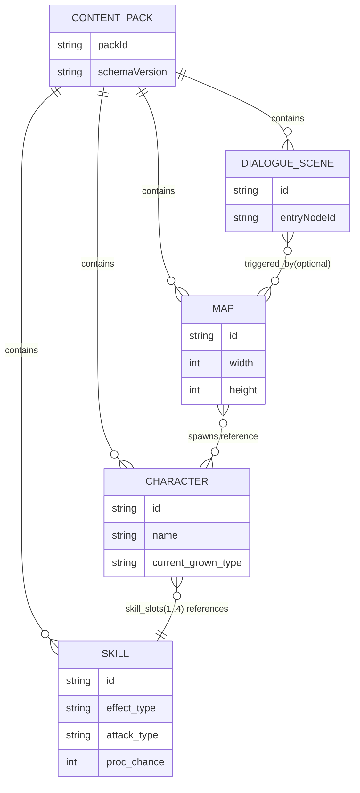

# TerraBattle Content Schema 단계 구현 계획 및 사용자 정의 템플릿

## 요약

TerraBattle는 **Vite + React(TypeScript) + PixiJS(@pixi/react)** 조합으로 “React는 HUD/장면 전환 및 상태, Pixi는 월드 렌더링”을 분리한 2D 타일(격자) 기반 프로토타입이며, 현재 구현 범위가 **Title 화면까지**로 명시되어 있습니다. fileciteturn7file0L1-L1 fileciteturn26file0L1-L1 fileciteturn29file0L1-L1

Research.md는 다음 단계에서 “콘텐츠 제작 툴(에디터)”를 가능하게 하려면, 먼저 **콘텐츠를 JSON으로 정의하고(JSON diff-friendly), JSON Schema 2020-12로 검증하며, ID 기반 참조/팩(Pack) 단위 Import·Export를 제공**해야 한다고 요구합니다. 또한 Export 시 **정렬/정규화(canonicalization)**로 diff 안정성을 확보할 것을 명시합니다. fileciteturn5file0L1-L1 citeturn0search0turn0search7

이 보고서는 위 요구를 “Content Schema 단계”로 좁혀, **(a) Skill/Character/Map/Dialogue 스키마 v1 확정, (b) 검증기(validator)와 참조 무결성 검사, (c) 샘플 Content Pack(개발용)과 로더(load/validate), (d) 버전·마이그레이션·테스트·배포(롤아웃) 전략**까지 포함한 실행 계획을 제시합니다. fileciteturn5file0L1-L1 fileciteturn9file0L1-L1

중요 리스크는 문서 수준의 스펙 편차입니다. 예를 들어 Research.md에는 한때 README↔package.json 테스트 스크립트 불일치가 언급되지만, 현재 저장소의 `package.json`에는 이미 `test`/`test:run`이 정의되어 있습니다. 따라서 Content Schema 단계에서는 **문서(Research/docs) 기반 요구를 우선하되, “현재 코드/설정과 충돌하는 항목은 사실관계로 분리해 명시”**하는 방식이 안전합니다. fileciteturn5file0L1-L1 fileciteturn8file0L1-L1

## Content Schema 관련 요구사항 및 예시 추출

Content Schema 단계에서 “반드시 고정해야 하는 요구”는 Research.md의 “콘텐츠 제작 툴” 섹션과 로드맵(Phase: Content Schema)에서 직접 도출됩니다. fileciteturn5file0L1-L1

핵심 요구는 다음으로 요약됩니다.

첫째, **콘텐츠 데이터의 기본 포맷은 JSON**이며, 사람/깃 diff에 친화적이어야 합니다. 스키마는 **JSON Schema 2020-12**를 기본으로 하여 검증/자동완성/문서화를 지원해야 합니다. fileciteturn5file0L1-L1 citeturn0search0turn0search3turn0search7

둘째, 모든 콘텐츠는 **불변(안정) ID(`id`)**를 갖고, 표시명(`name`)은 변경 가능하며, 참조는 **ID 기반( rename-safe )**으로 설계해야 합니다. fileciteturn5file0L1-L1

셋째, 스키마 검증은 “파일 단위(구조 검증)”뿐 아니라, **참조 무결성 검사(예: 스킬 ID 존재 여부)**까지 포함해야 하며, 검증 결과는 오류/경고로 구분해 표시할 수 있어야 합니다(에디터/툴 전제). fileciteturn5file0L1-L1

넷째, Import/Export는 단일/다중 JSON 및 Pack(묶음)을 지원해야 하며, Export 시 **정렬/정규화(canonicalization)**를 수행해 diff를 안정화해야 합니다. canonicalization의 “표준적 정의”를 채택하려면 RFC 8785(JCS)가 대표적 근거가 됩니다. fileciteturn5file0L1-L1 citeturn0search1

다섯째, 로드맵 상 Content Schema 단계의 완료 기준은 **Skill/Character/Map/Dialogue Schema v1 확정**입니다. fileciteturn5file0L1-L1 fileciteturn9file0L1-L1

저장소 `docs/*`는 “도메인 규칙/데이터 초안”을 제공하여 스키마의 구체 필드/제약을 뒷받침합니다.

- Skill: 필드 목록(`id`, `proc_chance`, `effect_type`, `attack_type`, `source_stat/affected_stat`, `multiplier`, `hit_count`, `duration_turns`, `composite_hits` 등)과 슬롯 해결 규칙이 문서화되어 있어, Skill 스키마 v1의 직접 근거가 됩니다. fileciteturn13file0L1-L1  
- Character: 캐릭터 JSON 형태(스탯 9종, 스킬 슬롯 1~4, 성장방식 `current_grown_type`, 좌표/타일 필드 등)가 예시와 함께 제시되어 있어, Character 스키마 v1의 직접 근거가 됩니다. fileciteturn32file0L1-L1  
- Growth/Stats: 레벨1 기본 스탯=50, 성장방식 목록(Power/Technique/Arcane/Ward/Balanced), 파생치/명중/데미지 등의 공식이 문서로 존재하여 “enum/범위/기본값” 제약 설계에 영향을 줍니다. fileciteturn14file0L1-L1  
- Core Definition: 격자 점유형/경계 통과 기반 조작, move/swap/block 결과 규칙, 드래그 종료 후 샌드위치 공격 등은 Map 스키마가 표현해야 하는 “보드 표현의 기본 전제”로 작동합니다. fileciteturn11file0L1-L1  

반대로, Map/Dialogue의 “데이터 구조 초안”은 Skill/Character에 비해 **저장소 문서에서 상대적으로 구체성이 부족**합니다(즉, 필드 설계에서 가정이 발생). 이는 아래 구현 계획에서 “미정/가정”으로 분리합니다. fileciteturn5file0L1-L1

## Content Schema 단계 구현 계획

아래 단계는 “스키마 정의 → 검증기/무결성 검사 → 로더/샘플 팩 → 마이그레이션/테스트/롤아웃” 순으로 설계되어 있으며, 저장소의 기본 원칙(ESM-only, domain/renderer 분리, class 기반 서비스, 타입 계약은 interface/type)을 준수하도록 구성했습니다. fileciteturn10file0L1-L1 fileciteturn15file0L1-L1 fileciteturn8file0L1-L1

1. Content Schema 범위와 “정적 콘텐츠 vs 저장 데이터” 경계 확정  
   입력: Research.md의 Content Pack/스키마 요구, Character/Skill 문서, SaveData 방향성 fileciteturn5file0L1-L1 fileciteturn32file0L1-L1 fileciteturn13file0L1-L1  
   출력: v1 스키마 대상(파일/엔티티) 목록, 각 필드의 “정적/런타임/세이브” 소유권 표  
   복잡도: medium  
   리스크: `level/exp/HP` 같은 필드가 “캐릭터 정의”인지 “세이브 상태”인지 불명확하면, 이후 SaveData 단계에서 중복/불일치가 발생  
   작업:  
   - v1에서 “CharacterDef(정적 정의)”와 “Party/UnitState(세이브)”를 분리할지 여부를 결정  
   - 결정이 어려우면 v1에서는 문서 예시(현재 Character JSON shape)를 **그대로 수용**하되, v1.1에서 분리 마이그레이션을 예정(아래 마이그레이션 프레임워크에 포함)

2. 스키마 버전 정책 수립  
   입력: Research.md의 “툴 버전 vs 스키마 버전 분리” 권고, 로드맵 단계 정의 fileciteturn5file0L1-L1  
   출력: `schemaVersion` 규칙(예: SemVer), 하위호환/마이그레이션 방침(필수/선택)  
   복잡도: medium  
   리스크: 버전 규칙이 모호하면 “팩이 언제/어떻게 깨지는지”가 불명확해짐(에디터/런타임 불일치)  
   작업:  
   - Pack 수준 `schemaVersion: "1.0.0"`(문자열) 채택  
   - Major 변경 시 마이그레이션 함수 제공을 원칙으로 규정  
   - tool/editor 버전은 별도(`toolVersion`)로 분리(팩과 독립 릴리스)

3. 공통 스키마 모듈 설계  
   입력: Skill/Character 문서의 반복 enum(스탯, 성장방식 등) fileciteturn13file0L1-L1 fileciteturn32file0L1-L1 fileciteturn14file0L1-L1  
   출력: `common.schema.(json|yaml)` + `$defs` 기반 재사용 타입  
   복잡도: low  
   리스크: 공통 타입 없이 개별 스키마에 enum이 분산되면 향후 변경 시 누락 위험 증가  
   작업:  
   - `StatKey`, `GrowthType`, `Id` 패턴, `TileCoord` 등 `$defs`에 정의  
   - JSON Schema 2020-12 메타스키마를 명확히 선언(`$schema`) citeturn0search0turn0search7

4. Skill 스키마 v1 작성  
   입력: `docs/skill_core_structure.md`의 필드/규칙/예시 fileciteturn13file0L1-L1  
   출력: `skill.schema.json`, `skills.file.schema.json`(배열/파일 레벨), v1 샘플 `skills.json`  
   복잡도: medium  
   리스크: `effect_type`별 필수 필드(`affected_stat`) 조건이 누락되면 런타임 계산/툴 프리뷰의 전제가 깨짐  
   작업:  
   - `proc_chance` 1~100(정수), `effect_type/attack_type/target_side` enum, `hit_count>=1`, `duration_turns>=0` 반영  
   - `if/then/else`로 `buff/debuff`일 때 `affected_stat` 필수화  
   - `composite_hits`가 존재하는 경우의 구조(각 hit도 `attack_type/source_stat/multiplier/hit_count`) 정의  
   - 문서 예시에 포함된 `animaiton_id` 오타/미정 필드는 `x_extra` 또는 `extensions`로 흡수하거나 v1에서 명시적으로 제외(결정 사항을 Q/A 템플릿에 포함)

5. Character 스키마 v1 작성  
   입력: `docs/character_core_structure.md` + 성장/스탯 문서 fileciteturn32file0L1-L1 fileciteturn14file0L1-L1  
   출력: `character.schema.json`, `characters.file.schema.json`, v1 샘플 `characters.json`  
   복잡도: medium  
   리스크: 스탯/성장방식/스킬 슬롯 제약이 “툴 UX”와 직결되므로, 스키마가 느슨하면 에디터에서 오류를 너무 늦게 발견  
   작업:  
   - `skill_slots`는 `"1".."4"` 키를 갖는 object로 고정(문서 shape 기반)  
   - GrowthType enum(Power/Technique/Arcane/Ward/Balanced) 반영  
   - 레벨1 기본 스탯 50 규칙은 **“기본값(디폴트)”** 또는 “검증 경고”로 처리(엄격 필수로 두면 콘텐츠 다양성 제한) fileciteturn14file0L1-L1  
   - (참조 무결성 단계에서) slot1 스킬은 `replaceable=false` & `proc_chance=100` 같은 규칙을 “교차 검증”으로 강제할지 결정(스키마만으로는 어려움)

6. Map 스키마 v1 초안 확정  
   입력: Core Definition(격자/점유/경계 통과) + Research.md의 “맵 편집/스폰/트리거 preview” 요구 fileciteturn11file0L1-L1 fileciteturn5file0L1-L1  
   출력: `map.schema.json`, 샘플 `maps/map_demo.json`  
   복잡도: high  
   리스크: 저장소 문서에 “맵 데이터 구조”가 구체적으로 정의되어 있지 않아, v1 스키마가 미래 전투 엔진 설계와 충돌할 가능성  
   작업(가정 기반, v1 최소안):  
   - `grid.width/height` + `blockedTiles[]`(좌표) + `spawns[]`(unitId/x/y/side) + `triggers[]`(조건/이벤트) 수준으로 최소화  
   - “드래그 중 연속 이동처럼 보이지만 상태 변화는 경계 통과 시점 평가” 전제를 반영하기 위해, 타일 좌표계/충돌 유형(move/swap/block)을 맵에서 표현 가능하게 설계 fileciteturn11file0L1-L1  
   - 상세 타일 속성(지형 타입, 비용, hazard 등)은 v1에서는 `extensions`로 열어두고 v1.1에서 확정(미정 사항으로 명시)

7. Dialogue 스키마 v1 초안 확정  
   입력: Research.md의 “다이얼로그 노드 그래프/타임라인 + 조건(전역변수) 분기 시뮬레이션” 요구 fileciteturn5file0L1-L1  
   출력: `dialogue.schema.json`, 샘플 `dialogues/dlg_demo.json`  
   복잡도: high  
   리스크: 전역변수(Global Variables)·트리거·세이브와 얽히므로, Content Schema 단독으로는 결정 불가한 필드가 다수 발생  
   작업(가정 기반, v1 최소안):  
   - 노드 기반(예: `line`, `choice`, `jump`, `end`, `setFlag`)으로 최소 타입부터 정의  
   - “조건식”은 v1에서 단순 비교(`key/op/value`) 형태로 제한하고, 키 네임스페이스 규칙은 SaveData 단계에서 확정(상호의존) fileciteturn5file0L1-L1

8. Content Pack(Manifest) 스키마 설계  
   입력: Research.md의 Pack 단위 설계(여러 JSON 파일 묶음) 및 디렉토리 예시 fileciteturn5file0L1-L1  
   출력: `pack.schema.json`(pack.json), pack 디렉토리 레이아웃 규정(문서)  
   복잡도: medium  
   리스크: “단일 파일 pack vs 다중 파일 pack” 선택이 툴/로더/배포 모두에 파급  
   작업:  
   - v1에서는 `pack.json`이 “파일 목록(상대경로)”을 선언하는 방식(Manifest) 채택  
   - `meta.packId`, `meta.schemaVersion`, `files.skills`, `files.characters`, `files.maps[]`, `files.dialogues[]` 규정  
   - 추후 zip export를 고려하여 “경로는 pack 루트 기준 상대경로”로 고정

9. JSON Schema 검증 엔진(validator) 구현  
   입력: JSON Schema 2020-12 스펙, Ajv의 2020-12 지원(브라우저/Node) citeturn0search0turn0search3turn2search6  
   출력: `ContentValidator`(class), 구조 검증 결과(오류 리스트) 표준 포맷  
   복잡도: medium  
   리스크: 런타임 번들 크기 증가(Ajv), 스키마 strict 옵션에 따른 호환성 문제  
   작업:  
   - Ajv를 도입하고, 2020-12 스펙 사용을 명시(예: ajv-cli는 draft2020 spec 옵션을 제공) citeturn2search4turn2search6  
   - 스키마 `$id`/`$ref` 해석이 깨지지 않도록 “스키마 로딩 순서/등록” 규칙화  
   - `additionalProperties: false`를 기본으로 하되 확장 필드는 `extensions`로 흡수(스키마 안정성)  
   - 에디터/런타임 공용으로 오류를 `path + message + severity`로 정규화

10. 참조 무결성(교차 검증) 레이어 구현  
   입력: Research.md의 참조 무결성 검사 요구, Skill/Character의 id 참조 구조 fileciteturn5file0L1-L1 fileciteturn32file0L1-L1  
   출력: `ContentIntegrityChecker`(class) + 규칙 목록(경고/오류)  
   복잡도: high  
   리스크: “스키마로 표현 불가한 규칙”이 누락되면 런타임에서 뒤늦게 크래시  
   작업(예시 규칙):  
   - ID 유일성(파일 내/팩 전체)  
   - Character.skill_slots에 선언된 skillId가 skills에 존재하는지  
   - slot1 규칙(교체 불가/100%)을 교차 검증으로 강제할지 선택(결정 사항 문서화) fileciteturn13file0L1-L1  
   - Map.spawns의 unitId가 characters(또는 별도 enemy 정의)에 존재하는지(현 시점 미정이면 경고 처리)  
   - Dialogue.jump/choice.next가 유효 노드로 연결되는지

11. Content Repository(로더/캐시) 구현  
   입력: ESM-only 구조, JSON 모듈 로딩 가능(`resolveJsonModule`), 공통 캔버스/장면 전환 구조 fileciteturn10file0L1-L1 fileciteturn41file0L1-L1 fileciteturn26file0L1-L1  
   출력: `ContentRepository`(class), `loadPack(packId)` API, 캐시 전략  
   복잡도: medium  
   리스크: 개발용 번들 인라인(pack import)과 배포용 외부 파일(fetch) 간 경로/배포 정책이 충돌  
   작업:  
   - v1에서는 “개발용 packId=dev”를 코드에서 import(정적)하는 경로를 우선 제공(안정적)  
   - 이후 툴 단계에서 파일 Import/Export가 들어오면, 파일 핸들/드래그앤드롭 입력도 같은 Repository 인터페이스로 수용(Ports/Infrastructure 원칙) fileciteturn15file0L1-L1  
   - 로드 시점에 `validator → integrity checker` 순으로 통과해야만 Runtime에 주입

12. Export 정렬/정규화(canonicalization) 구현 및 계약 확정  
   입력: Research.md의 canonicalization 요구, RFC 8785(JCS) fileciteturn5file0L1-L1 citeturn0search1  
   출력: `canonicalizeJson()` 유틸, Export 규칙 문서(키 정렬/숫자/문자열 처리)  
   복잡도: high  
   리스크: 정규화 규칙 변경은 diff 대폭발을 유발 → “Major 변경” 취급 필요  
   작업:  
   - 최소 목표: object key의 결정적 정렬 + 공백 제거 + 줄바꿈 규칙 고정  
   - 권장 목표: RFC 8785 준수(특히 숫자 직렬화 규칙)로 해시/서명/팩 검증에도 확장 가능 citeturn0search1  
   - 도입 시점: Content Schema 단계에서 “규칙/함수”를 먼저 고정하고, 실제 zip export/UI는 Tool 단계로 이월 가능

13. 마이그레이션 프레임워크(콘텐츠) 설계  
   입력: Research.md의 “스키마 변경 시 마이그레이션 함수 필수” 원칙 fileciteturn5file0L1-L1  
   출력: `ContentMigrator`(class) + `migrations: Record<version, fn>` + 테스트 골든 데이터  
   복잡도: medium  
   리스크: v1에서 “미정 필드”를 많이 남기면 v2에서 마이그레이션 부하 급증  
   작업:  
   - `pack.meta.schemaVersion`을 기준으로 단계적 업그레이드(`1.0.0 -> 1.1.0 -> 2.0.0`)  
   - 각 마이그레이션은 “구조 변환 → 스키마 재검증 → 무결성 재검증”을 원칙으로 고정  
   - `animaiton_id` 같은 오탈자 호환은 마이그레이션에서 흡수하는 전략이 가장 안전

14. 테스트 전략 수립 및 CI 품질 게이트 통합  
   입력: 현재 테스트 러너(Vitest)와 스크립트 존재, 프로젝트 규칙(변경 시 테스트) fileciteturn8file0L1-L1 fileciteturn10file0L1-L1  
   출력: `content-schema` 테스트 스위트, `npm run content:validate`(또는 동등) 스크립트, CI 실행 항목 추가  
   복잡도: medium  
   리스크: 스키마/무결성 규칙이 테스트로 고정되지 않으면, 툴/런타임 개발 중 “조용한 파손”이 누적  
   작업:  
   - 긍정 테스트: 샘플 pack이 구조 검증 + 무결성 검증 통과  
   - 부정 테스트: (a) 누락된 required 필드, (b) 잘못된 enum, (c) 존재하지 않는 skillId 참조, (d) dialogue broken link 등  
   - 성능 테스트(간단): pack 크기 증가 시 검증 시간(개발 모드) 상한 점검  
   - CI: `typecheck + test:run + build`에 더해 `content:validate`를 추가하는 것을 권장(단, 아직 Tool 단계 전이라면 “샘플 pack 검증”까지만) fileciteturn8file0L1-L1

15. 롤아웃(점진 적용) 계획  
   입력: 현재는 Title만 존재하고, 향후 Battle/Tool/Save로 확장 예정 fileciteturn9file0L1-L1 fileciteturn7file0L1-L1  
   출력: 적용 범위/플래그 정책, 개발자 문서(“팩 만들기/검증하기/깨졌을 때”)  
   복잡도: low  
   리스크: 초기부터 “런타임에서 실패=게임 실행 불가”로 만들면 개발 속도가 급락할 수 있음  
   작업:  
   - DEV 모드: 로드시 반드시 validate+integrity 수행(실패 시 상세 오류 노출)  
   - PROD 모드: 초기에는 경고 로그 + 안전한 fallback(예: dev pack으로 강제) 옵션을 허용하고, Tool MVP 이후 “하드 실패”로 전환  
   - `docs/step/ContentSchema.md` 신규 작성(현재 docs/step은 Foundation만 존재) fileciteturn20file0L1-L1

## 스키마 예시 및 샘플 콘텐츠

아래 예시는 저장소 `docs/*`에 명시된 Skill/Character 구조를 최대한 존중하면서(Content Schema v1), Pack Manifest 기반 다중 파일 구성을 전제로 작성했습니다. fileciteturn13file0L1-L1 fileciteturn32file0L1-L1 fileciteturn5file0L1-L1  
(JSON Schema의 근거는 2020-12 스펙입니다.) citeturn0search0turn0search7

### JSON Schema 예시

```json
{
  "$schema": "https://json-schema.org/draft/2020-12/schema",
  "$id": "terrabattle://schema/skill.schema.json",
  "title": "SkillDef",
  "type": "object",
  "additionalProperties": false,
  "required": [
    "id",
    "name",
    "replaceable",
    "proc_chance",
    "effect_type",
    "attack_type",
    "target_side",
    "source_stat",
    "multiplier",
    "hit_count",
    "duration_turns",
    "description"
  ],
  "properties": {
    "id": { "type": "string", "pattern": "^skill_[a-z0-9_]+$" },
    "name": { "type": "string", "minLength": 1, "maxLength": 80 },
    "replaceable": { "type": "boolean" },
    "proc_chance": { "type": "integer", "minimum": 1, "maximum": 100 },
    "effect_type": { "type": "string", "enum": ["damage", "buff", "debuff", "heal"] },
    "attack_type": { "type": "string", "enum": ["physical", "magical", "auto"] },
    "target_side": { "type": "string", "enum": ["self", "ally", "enemy"] },
    "source_stat": { "$ref": "terrabattle://schema/common.schema.json#/$defs/StatKey" },
    "affected_stat": {
      "anyOf": [
        { "type": "null" },
        { "$ref": "terrabattle://schema/common.schema.json#/$defs/StatKey" }
      ]
    },
    "multiplier": { "type": "number", "exclusiveMinimum": 0 },
    "hit_count": { "type": "integer", "minimum": 1, "maximum": 99 },
    "duration_turns": { "type": "integer", "minimum": 0, "maximum": 999 },
    "composite_hits": {
      "anyOf": [
        { "type": "null" },
        {
          "type": "array",
          "minItems": 1,
          "items": {
            "type": "object",
            "additionalProperties": false,
            "required": ["attack_type", "source_stat", "multiplier", "hit_count"],
            "properties": {
              "attack_type": { "type": "string", "enum": ["physical", "magical"] },
              "source_stat": { "$ref": "terrabattle://schema/common.schema.json#/$defs/StatKey" },
              "multiplier": { "type": "number", "exclusiveMinimum": 0 },
              "hit_count": { "type": "integer", "minimum": 1, "maximum": 99 }
            }
          }
        }
      ]
    },
    "description": { "type": "string", "minLength": 0, "maxLength": 500 },
    "extensions": { "type": "object" }
  },
  "allOf": [
    {
      "if": { "properties": { "effect_type": { "enum": ["buff", "debuff"] } }, "required": ["effect_type"] },
      "then": { "required": ["affected_stat"], "properties": { "affected_stat": { "not": { "type": "null" } } } }
    },
    {
      "if": { "properties": { "effect_type": { "const": "damage" } }, "required": ["effect_type"] },
      "then": {
        "properties": {
          "attack_type": { "enum": ["physical", "magical", "auto"] }
        }
      }
    }
  ]
}
```

### YAML 스키마 예시

(Content Pack Manifest를 YAML로 표현한 예시이며, JSON Schema를 YAML로 직렬화한 형태입니다.)

```yaml
$schema: "https://json-schema.org/draft/2020-12/schema"
$id: "terrabattle://schema/pack.schema.yaml"
title: "ContentPackManifest"
type: object
additionalProperties: false
required: [meta, files]
properties:
  meta:
    type: object
    additionalProperties: false
    required: [packId, schemaVersion]
    properties:
      packId:
        type: string
        pattern: "^[a-z][a-z0-9_-]{0,31}$"
      schemaVersion:
        type: string
        pattern: "^[0-9]+\\.[0-9]+\\.[0-9]+$"
      createdAt:
        type: string
      updatedAt:
        type: string
  files:
    type: object
    additionalProperties: false
    required: [skills, characters, maps, dialogues]
    properties:
      skills:
        type: string
        const: "skills.json"
      characters:
        type: string
        const: "characters.json"
      maps:
        type: array
        items:
          type: string
          pattern: "^maps/.+\\.json$"
      dialogues:
        type: array
        items:
          type: string
          pattern: "^dialogues/.+\\.json$"
```

## 필드 타입·제약 비교 표

아래 표는 저장소 문서에서 명시된 핵심 필드와, Content Schema v1에서 권장되는 JSON Schema 제약을 비교한 것입니다. (Skill/Character의 필드 정의 근거) fileciteturn13file0L1-L1 fileciteturn32file0L1-L1

| JSON Schema 타입 | 흔한 제약 키워드 | TerraBattle 적용 예 | 비고 |
|---|---|---|---|
| string | `minLength`, `maxLength`, `pattern`, `enum` | `id`는 prefix+패턴, `effect_type`는 enum | ID 정책은 참조 안정성에 직결 |
| integer | `minimum`, `maximum` | `proc_chance` 1~100, `tile_x` 0 이상 | 좌표/턴/레벨 등에 사용 |
| number | `exclusiveMinimum`, `multipleOf` | `multiplier` > 0 | 밸런싱 변경이 잦으므로 범위만 우선 고정 |
| boolean | (없음) | `replaceable` | 교차 검증 규칙과 함께 쓰임 |
| object | `required`, `additionalProperties`, `properties` | `skill_slots` 키 고정, `meta` 구조 고정 | strict 모드면 `additionalProperties:false` 권장 |
| array | `minItems`, `items`, `uniqueItems` | `composite_hits`, `maps[]` | 순서 의미가 있으면 정렬/정규화 규칙이 필요 |
| null | `type:null`, `anyOf` | `affected_stat: null 가능` | 효과 타입에 따라 필수/비필수 전환 |

### Skill 필드 비교(요약)

| 필드 | 타입 | 제약(권장) | 예시 |
|---|---|---|---|
| `id` | string | `^skill_...$` | `skill_basic_physical_attack` |
| `proc_chance` | integer | 1~100 | 100 |
| `effect_type` | string enum | damage/buff/debuff/heal | damage |
| `attack_type` | string enum | physical/magical/auto | physical |
| `source_stat` | string enum | STR..LUK | STR |
| `affected_stat` | enum or null | buff/debuff면 필수 | VIT |
| `multiplier` | number | >0 | 1.5 |
| `hit_count` | integer | >=1 | 3 |
| `duration_turns` | integer | >=0 | 0 |
| `composite_hits` | array/null | hit object 배열 | `[{...},{...}]` |

### Character 필드 비교(요약)

| 필드 | 타입 | 제약(권장) | 예시 |
|---|---|---|---|
| `id` | string | `^char_...$` | `char_001` |
| `skill_slots` | object | 키 `"1".."4"` 고정 | `{ "1": "...", ... }` |
| `STR..LUK` | integer | (권장) >=1 | 50 |
| `current_grown_type` | enum | Power/Technique/Arcane/Ward/Balanced | Balanced |
| `tile_x/y/w/h` | integer | 0 이상 | 0/0/1/1 |

## Mermaid 다이어그램

### 엔티티 관계도



### 구현 타임라인 플로우차트

```mermaid
flowchart TD
  A[Scope/Boundary 확정] --> B[버전 정책 수립]
  B --> C[공통 스키마/enum 정의]
  C --> D[Skill/Character 스키마 v1]
  D --> E[Map/Dialogue v1 최소안]
  E --> F[Pack Manifest 스키마]
  F --> G[Validator(Ajv 2020-12) 구현]
  G --> H[참조 무결성 검사 구현]
  H --> I[샘플 Dev Pack 작성]
  I --> J[Content Repository(Load+Cache) 구현]
  J --> K[정규화(canonicalization) 규칙 고정]
  K --> L[마이그레이션 프레임워크]
  L --> M[테스트+CI 통합]
  M --> N[DEV 강제검증 → PROD 점진강화]
```

## 사용자 Q/A 템플릿

아래는 “Content Schema를 확정하기 위해 사용자(기획/밸런스/툴 사용자)가 채워야 하는 질문지” 템플릿입니다. 답변이 없는 항목은 v1에서 **가정(assumption)**으로 남아 마이그레이션 비용이 커질 수 있습니다. fileciteturn5file0L1-L1

```markdown
# Content Schema 정의 Q/A

## 범위와 소유권
- Q1. 이번 v1 Content Schema에 포함할 콘텐츠 타입은?
  - (예: Skill, Character, Map, Dialogue, Item, Enemy 등)
  - A: Skill, Character, Map, Dialogue, Enemy = Character

- Q2. Character JSON에 있는 `level/exp/HP`는 “정적 콘텐츠”인가요, “세이브/런타임 상태”인가요?
  - A: 초기값 및 세이브/런타임

## ID 정책
- Q3. ID 네이밍 규칙을 고정할까요?
  - (예: skill_*, char_*, map_*, dlg_* / 정규식 / 최대 길이)
  - A: 고정해주세요.

- Q4. 표시명(`name`) 변경은 자유롭고, 참조는 `id`만 사용한다는 원칙에 동의하나요?
  - A: Yes

## Skill Schema
- Q5. Skill의 필수 필드는 무엇으로 고정할까요?
  - (문서상 최소 후보: id/name/replaceable/proc_chance/effect_type/attack_type/target_side/source_stat/affected_stat/multiplier/hit_count/duration_turns/composite_hits/description)
  - A: 후보 모두

- Q6. `buff/debuff`에서 `affected_stat`은 항상 필수인가요?
  - A: 필수

- Q7. 스킬에 애니메이션/이펙트 참조 필드가 필요하나요?
  - (예: animation_id / effect_id / sfx_id)
  - A: 옵션으로 빈값으로 하고 나중에 에니메이션 구현시 사용

## Character Schema
- Q8. Character의 “스킬 슬롯 1번은 100% 발동, 교체 불가” 규칙을 데이터로 강제할까요?
  - (스키마에서 강제 vs 교차검증에서 강제 vs 문서/툴 경고만)
  - A: 강제 

- Q9. 성장방식(GrowthType)은 고정 5종(Power/Technique/Arcane/Ward/Balanced)인가요? 확장 가능해야 하나요?
  - A: 고정5종 

- Q10. 스탯 기본값(레벨1=50)은 “강제”인가요 “권장 기본값”인가요?
  - A: 권장 기본값 

## Map Schema
- Q11. Map 데이터는 어떤 표현을 원하나요?
  - (예: width/height + blockedTiles 목록 / 타일 레이어(2D 배열) / Tiled 유사 포맷 등)
  - A: 타일 레이어 2D배열, 아군, 적군, 장애물 초기위치

- Q12. Map이 포함해야 할 최소 요소는?
  - (예: 스폰, 장애물, 목표, hazard, 트리거, 배경 리소스)
  - A: 스폰, 장애물, 목표, hazard, 트리거, 배경 리소스

- Q13. 적/오브젝트는 Character와 같은 정의를 재사용하나요? 별도 Enemy/Object 스키마가 필요하나요?
  - A: 같은 정의

## Dialogue Schema
- Q14. Dialogue의 최소 노드 타입은?
  - (예: line, choice, jump, end, setFlag, reward 등)
  - A: 질문이 이해가 안되지만, 비주얼노벨처럼 구현할 예정. 텍스트, 이미지, 배경음, 효과음, 선택지 정도.

- Q15. 조건 분기와 전역변수 키 네임스페이스 규칙은?
  - (예: flags.chapter1.cleared 같은 형태)
  - A: flags.chapter1.cleared

## Pack/배포/검증
- Q16. Pack은 단일 JSON(한 파일)인가요, Manifest+다중 파일인가요?
  - A: 한파일

- Q17. Export 시 JSON 정규화(canonicalization)를 어떤 수준으로 적용할까요?
  - (키 정렬만 / RFC 8785 준수 / 숫자 직렬화까지 엄격)
  - A: 키 정렬만

- Q18. 런타임에서 스키마 검증 실패 시 정책은?
  - (DEV: 하드 실패 / PROD: 경고+fallback / PROD도 하드 실패 등)
  - A: 경고+fallback

## 버전/마이그레이션
- Q19. schemaVersion 규칙은 SemVer(1.0.0)로 할까요?
  - A: 1.0.0

- Q20. v1 이후 “깨지는 변경”(Major)을 허용하는 기준은?
  - A: 추천안
```
