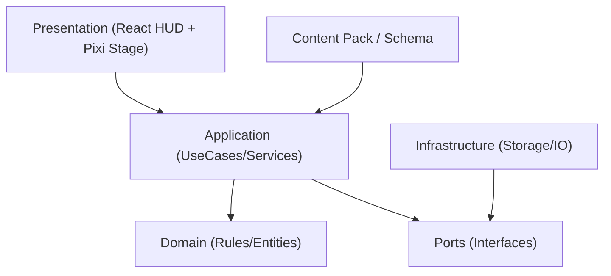
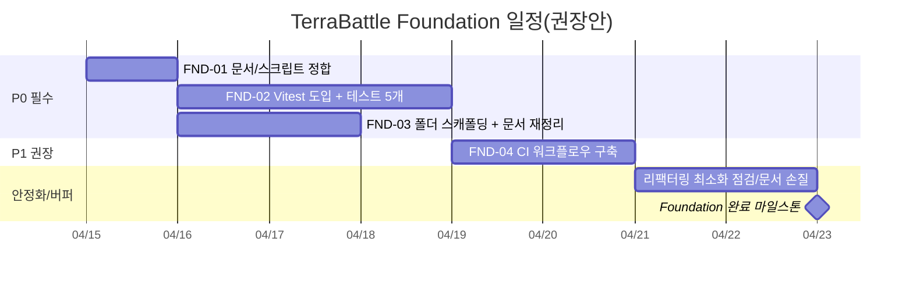
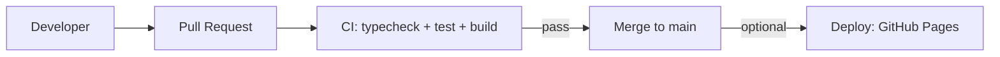

# TerraBattle RoadMap ‘Foundation’ 단계 완료를 위한 개발 계획

## 실행 요약

TerraBattle 저장소는 Vite 기반의 React(TypeScript) UI와 PixiJS 월드 렌더링을 결합한 2D 타일 기반 프로토타입이며, 현재 구현 범위는 **Title 화면까지**로 명시되어 있습니다. fileciteturn7file0L17-L21 또한 앱 엔트리(`index.html → src/main.ts`)에서 React 루트를 구성하고, 공통 Pixi 캔버스를 유지한 채 장면별 Stage/HUD를 조건 렌더링하는 구조가 이미 잡혀 있습니다. fileciteturn33file0L1-L15 fileciteturn34file0L1-L14 fileciteturn15file0L19-L43

Research.md 내 RoadMap 표는 ‘Foundation’ 단계를 **(a) README↔scripts 정합, (b) Vitest 도입, (c) 기본 폴더 구조 확정**으로 정의하며, 최소 산출물로 `test` 스크립트/도메인 테스트 최소 5개/폴더 스캐폴딩을 요구합니다(오버엔지니어링이 주요 리스크로 명시). fileciteturn43file0L1-L999

본 보고서는 위 정의를 “실행 가능한 작업 항목”으로 분해하여, **우선순위(P0–P2)**, **역할/의존성/리스크**, **파일 단위 변경 계획**, **검증(테스트·CI)**, **완료 일정(간트)**까지 포함한 ‘Foundation 완료 계획’을 제시합니다. (가정: 팀 규모/마감일은 명시 제약이 없으므로, **1–2명의 개발자가 2주(10영업일) 내 완료** 가능한 범위로 산정하되, 일정은 조정 가능하다고 전제합니다.)

또한 현재 의존성은 Vite 8 계열을 사용하므로, 개발·CI 환경은 **Node.js 20.19+ 또는 22.12+**를 기준으로 고정하는 것이 안전합니다. citeturn2search0turn2search3turn2search9 Vitest는 설치/실행 가이드에서 **Node >= 20** 및 **Vite >= 6** 요구사항을 명시하고, `package.json`에 `test` 스크립트를 추가하는 기본 패턴을 제시합니다. citeturn1search0

## 현재 상태와 Foundation 범위 정의

현재 저장소 상태(Foundation 착수 시점)에서 핵심 팩트는 아래와 같습니다.

- README는 현재 스택( Node.js/TypeScript/PixiJS/React HUD )과 “Title 화면까지 구현”을 밝히고, 실행 명령으로 `npm test`를 안내하지만 fileciteturn7file0L1-L28  
- `package.json`에는 `dev/build/preview/typecheck`만 존재하고 `test` 스크립트가 없습니다. fileciteturn8file0L10-L15  
- 코딩 규칙은 AGENTS.md에 “도메인 로직과 렌더링 로직 분리”, ESM-only, class 기반 도메인, interface/type 기반 데이터 계약, TSDoc(한국어) 등으로 정의되어 있습니다. fileciteturn9file0L1-L44  
- Vite 설정은 `vite.config.js`에 존재하며, dev server는 `host: true`로 설정되어 있습니다. fileciteturn32file0L1-L9  
- 화면/레이아웃 기준은 1080×1920 가상 기준 해상도 정책으로 문서화되어 있고, 코드에도 상수로 존재합니다. fileciteturn11file0L1-L79 fileciteturn14file0L1-L23  

Foundation 단계의 “완료”는 Research.md 정의를 그대로 수용하되, 실제 운영 관점에서 아래의 **완료 기준(Definition of Done)**을 추가로 제안합니다.

| 구분 | Foundation 공식 요구(Research.md) | 본 계획에서의 완료 기준(DoD) |
|---|---|---|
| 문서/스크립트 정합 | README↔scripts 정합 fileciteturn43file0L1-L999 | README의 명령/전제(Node 버전 포함)가 `package.json`과 일치하고, 새 개발자가 “clone→install→dev→test→build”를 문서만 보고 재현 가능 fileciteturn7file0L23-L28 fileciteturn8file0L10-L15 |
| 테스트 도입 | Vitest 도입 + 최소 도메인 테스트 5개 fileciteturn43file0L1-L999 | `npm run test:run`(또는 동등)으로 CI에서 1회 실행 가능한 테스트 세트 + 최소 5개 테스트 케이스 + 실패 시 원인 파악 가능한 출력 |
| 구조 정리 | 기본 폴더 구조 확정(스캐폴딩) fileciteturn43file0L1-L999 | “새 기능이 들어갈 자리”가 결정되어 있고(폴더/README), AGENTS 규칙과 충돌 없이 확장 가능 fileciteturn9file0L1-L44 |
| 품질 게이트(권장) | (명시 없음) | PR/푸시마다 typecheck+test+build가 자동 실행되는 CI(최소 1개 워크플로우) |

## 우선순위 기반 작업 분해

Foundation 요구사항을 실제 구현 단위로 분해하면 아래와 같습니다(우선순위는 리스크/선행조건 기준).

| ID | 항목 | 우선순위 | 핵심 결과 | 주요 의존성 | 예상 노력 |
|---|---|---:|---|---|---|
| FND-01 | 문서/스크립트 정합(README↔package.json) | P0 | README 명령이 실제 동작 + Node 요구조건 명시 | 없음 | 0.5–1일 |
| FND-02 | Vitest 도입 + 최소 5 테스트(도메인 중심) | P0 | 테스트 러너/스크립트/테스트 케이스 ≥ 5 | FND-01 | 1–2일 |
| FND-03 | 기본 폴더 구조 스캐폴딩 + 문서 재정리( RoadMap 분리 권장 ) | P0 | “어디에 무엇을 둘지”가 합의된 상태 | FND-01 | 0.5–1.5일 |
| FND-04 | CI 워크플로우( typecheck + test + build ) | P1 | PR/푸시 품질 게이트 자동화 | FND-02 | 0.5–1일 |
| FND-05 | 코드 스타일 자동화(선택: Prettier/ESLint) | P2 | 포맷/린트 규칙의 자동 검증 | FND-01 | 0.5–1일 |
| FND-06 | 배포 파이프라인 노트/초기 워크플로우(선택: GitHub Pages) | P2 | “빌드 결과를 어디에 둘지” 기준 수립 | FND-01 | 0.5–1일 |

Node 버전 고정은 P0에 포함되는 “실행 재현성” 요소입니다. Vite 8은 Node.js 20.19+ 또는 22.12+ 필요(ESM-only 배포 전제)로 공지되어 있습니다. citeturn2search0turn2search9 Vitest 역시 Node >=20 및 Vite >=6을 요구합니다. citeturn1search0

## 항목별 상세 개발 작업

아래는 각 항목을 **단계별 작업 → 산출물 → 수용 기준 → 노력/역할 → 의존성 → 리스크/완화**로 정리한 실행 계획입니다. (표 안의 파일 경로는 현 저장소 구조를 기준으로 합니다.)

### FND-01 문서/스크립트 정합

| 구분 | 내용 |
|---|---|
| 목표 | README가 안내하는 명령이 실제로 동작하도록 `package.json` 스크립트/전제조건을 정리하고, 개발자 온보딩 최소 문서를 완성한다. fileciteturn7file0L23-L28 fileciteturn8file0L10-L15 |
| 단계별 작업 | (1) README “Commands”와 `package.json/scripts`를 비교하여 불일치 목록 작성(현재 `npm test`만 불일치) fileciteturn7file0L23-L28 fileciteturn8file0L10-L15  (2) `package.json`에 테스트 관련 스크립트 추가(예: `test`, `test:run`, `coverage` 중 최소 1개) citeturn1search0  (3) README에 Node 요구버전(20.19+/22.12+)과 설치/실행 순서(install→dev→test→build) 섹션 추가 citeturn2search0turn2search9  (4) 선택: `package.json`에 `engines.node` 추가로 로컬/CI 환경을 고정(“잘못된 Node 버전에서 실패”를 조기 발견) |
| 변경 파일/경로 | `package.json`(scripts/engines) fileciteturn8file0L1-L45, `README.md`(Commands/Prerequisites 섹션) fileciteturn7file0L1-L28 |
| 기대 산출물 | - `npm test`가 실제로 실행 가능  - README에 “필수 Node 버전”과 “정상 실행 커맨드”가 명시 |
| 수용 기준(AC) | - 새 체크아웃 환경에서 `npm install` 후 `npm run dev`, `npm run typecheck`, `npm run build`, `npm run test:run`(또는 동등)이 모두 성공  - README의 Commands가 `package.json/scripts`와 100% 일치 |
| 노력 추정 | 4–8시간 |
| 필요 역할/스킬 | FE(React/Vite), 기본 Node/NPM |
| 의존성 | 없음 |
| 리스크/완화 | - **리스크:** Node 버전 불일치로 팀원별 로컬 환경 오류  - **완화:** README+engines+CI에서 Node를 고정(20.19+ 또는 22.12+) citeturn2search0turn2search9 |

**예시 변경(요지, package.json 스크립트 추가)**

```jsonc
{
  "scripts": {
    "dev": "vite",
    "build": "tsc --noEmit && vite build",
    "preview": "vite preview",
    "typecheck": "tsc --noEmit",
    "test": "vitest",
    "test:run": "vitest run",
    "coverage": "vitest run --coverage"
  },
  "engines": {
    "node": "^20.19.0 || >=22.12.0"
  }
}
```

위 스크립트 추가 패턴(`test: vitest`)은 Vitest 공식 가이드가 제시하는 기본 절차와 정합합니다. citeturn1search0

### FND-02 Vitest 도입 + 최소 5 테스트

| 구분 | 내용 |
|---|---|
| 목표 | “도메인/상태 로직은 테스트 가능해야 한다”는 AGENTS 원칙을 기반으로, Vitest를 도입하고 최소 5개의 테스트 케이스를 만든다. fileciteturn9file0L7-L31 |
| 단계별 작업 | (1) `vitest`(선택: `@vitest/coverage-v8`) devDependency 추가 및 lockfile 업데이트 citeturn1search0  (2) 테스트 실행 경로 확정: `npm test`(watch) + `npm run test:run`(CI 1회 실행) citeturn1search0  (3) 테스트 파일 배치 전략 결정: “코드 근처(동일 폴더)”를 기본으로 사용(리팩터링 시 함께 이동)  (4) 최소 5개 테스트 케이스 작성(권장: 현재 존재하는 순수 로직 중심)  (5) 실패 시 디버깅 가이드(README 또는 docs)에 최소 3줄로 추가(예: `npm run test:run -- --reporter=verbose`) |
| 권장 테스트 대상 | - `createInitialGameState()` 기본값 검증 fileciteturn36file0L8-L15  - `gameStateReducer()`가 각 액션(`set-scene`, `set-turn`, `set-selected-unit`, `open-modal`, `close-modal`)을 정확히 반영하는지 검증 fileciteturn36file0L24-L57  - (추가 1개) `VIRTUAL_RESOLUTION`/상수 일관성 검증(가상 해상도 정책의 “코드 기준점” 확보) fileciteturn14file0L9-L23 |
| 변경 파일/경로 | `package.json`(devDependencies/scripts) fileciteturn8file0L10-L38, 테스트 파일 신규 추가(예: `src/game/state/GameStateReducer.test.ts`) |
| 기대 산출물 | - 테스트 러너 실행 가능  - 테스트 케이스(최소 5개)  - CI에서 1회 실행 가능한 커맨드 |
| 수용 기준(AC) | - `npm run test:run`이 0 exit code로 종료  - 최소 5개 테스트 케이스가 수행되며(“0 tests” 금지)  - 테스트는 네트워크/시간/랜덤 등 외부 요인 없이 재현 가능 |
| 노력 추정 | 1–2일(8–16시간) |
| 필요 역할/스킬 | FE/TS, 테스트 설계(입력-출력/상태 전이), 기본 CI 경험 |
| 의존성 | FND-01(스크립트 정합) |
| 리스크/완화 | - **리스크:** UI/렌더링(Pixi) 테스트를 억지로 포함해 초기 세팅이 복잡해짐  - **완화:** Foundation에서는 “순수 로직/상태 전이” 중심으로 테스트 범위를 제한하고, 렌더링 스모크 테스트는 후속 단계로 이월 fileciteturn9file0L7-L31 |

**예시 테스트(요지, GameStateReducer 중심)**

```ts
// src/game/state/GameStateReducer.test.ts
import { describe, expect, it } from "vitest";
import { createInitialGameState, gameStateReducer } from "./GameStateReducer.js";

describe("GameStateReducer", () => {
  it("초기 상태는 title/player/null/null 이어야 한다", () => {
    expect(createInitialGameState()).toEqual({
      scene: "title",
      turn: "player",
      selectedUnitId: null,
      modal: null,
    });
  });

  it("set-scene 액션은 scene만 변경해야 한다", () => {
    const state = createInitialGameState();
    const next = gameStateReducer(state, { type: "set-scene", scene: "battle" });
    expect(next.scene).toBe("battle");
    expect(next.turn).toBe("player");
  });

  it("set-turn 액션은 turn만 변경해야 한다", () => {
    const state = createInitialGameState();
    const next = gameStateReducer(state, { type: "set-turn", turn: "enemy" });
    expect(next.turn).toBe("enemy");
  });

  it("set-selected-unit 액션은 selectedUnitId를 변경해야 한다", () => {
    const state = createInitialGameState();
    const next = gameStateReducer(state, { type: "set-selected-unit", selectedUnitId: "u1" });
    expect(next.selectedUnitId).toBe("u1");
  });

  it("open/close modal은 modal을 설정/해제해야 한다", () => {
    const state = createInitialGameState();
    const opened = gameStateReducer(state, { type: "open-modal", modal: "options" });
    expect(opened.modal).toBe("options");

    const closed = gameStateReducer(opened, { type: "close-modal" });
    expect(closed.modal).toBeNull();
  });
});
```

여기서 테스트 대상 함수/액션 구조는 이미 코드로 정의되어 있어, “현재 구현을 보호하는 최소 안전망”으로 적합합니다. fileciteturn36file0L1-L57 fileciteturn20file0L1-L38

### FND-03 기본 폴더 구조 스캐폴딩 + 문서 재정리

| 구분 | 내용 |
|---|---|
| 목표 | 이후 단계(Content Schema/Tool/Battle/SaveData) 확장을 위해 “폴더·레이어링 규칙”을 확정하고, 문서 구조를 혼동 없이 정리한다. AGENTS의 “도메인 중심 구조” 가이드를 충족해야 한다. fileciteturn9file0L45-L76 |
| 단계별 작업 | (1) `src/` 레이어링 원칙을 1쪽짜리로 정의(`docs/architecture.md` 또는 동등)  (2) 최소 스캐폴딩 디렉토리 생성(빈 폴더만이 아니라, 목적을 담은 `README.md`/`index.ts` 등 최소 앵커 파일 포함)  (3) Research.md가 “RoadMap.md를 포함한다”는 서술과 달리 실제로 `RoadMap.md` 파일이 없으므로, **RoadMap을 별도 파일로 분리**하는 것을 권장(문서 위치를 단일 진실원으로 만들기) fileciteturn43file0L1-L999  (4) README에서 문서 링크를 “core_definition/resolution_rule/RoadMap”으로 정리 |
| 권장 스캐폴딩(예시) | - `src/game/domain/` (전투 규칙/엔티티 class)  - `src/game/application/` (유스케이스/서비스)  - `src/game/ports/` (IStorage/IRng 등 인터페이스)  - `src/game/infrastructure/` (IndexedDB/파일 입출력 등 어댑터)  - `src/content/` (스키마/팩/로더)  - `src/tools/` (에디터 UI) |
| 변경 파일/경로 | 신규: `RoadMap.md`(Research에서 추출), `docs/architecture.md`, `src/game/domain/README.md` 등 앵커 파일 / 수정: `README.md` 문서 링크 보강 fileciteturn7file0L12-L16 |
| 기대 산출물 | - “새 기능을 어디에 넣을지”가 합의된 기준  - 문서 진입점 1–2개(README→RoadMap→Architecture) |
| 수용 기준(AC) | - 신규 폴더/문서 추가가 기존 빌드에 영향 없음(`npm run build` 통과) fileciteturn8file0L10-L15  - AGENTS의 구조 원칙(도메인 기준/타입 파일 규칙)이 신규 스캐폴딩에 반영됨 fileciteturn9file0L45-L76 |
| 노력 추정 | 0.5–1.5일 |
| 필요 역할/스킬 | 테크 리드(아키텍처 합의), FE(리포 구조 변경) |
| 의존성 | FND-01 권장(README 정리와 동시 처리 가능) |
| 리스크/완화 | - **리스크:** 폴더 구조를 과도하게 세분화하여 실 구현보다 문서만 커짐(Research에서도 리스크로 언급)  - **완화:** “폴더만 먼저 만들고, 실제 코드 이동/대규모 리팩터링은 다음 단계에서 필요할 때 수행”으로 제한 fileciteturn43file0L1-L999 |

**레이어링(의존 방향) 다이어그램(mermaid)**



이 구조는 AGENTS의 “도메인/렌더링 분리” 및 “class 기반 도메인, interface/type 기반 데이터 계약” 원칙과 정합합니다. fileciteturn9file0L7-L31

### FND-04 CI 워크플로우 구축

| 구분 | 내용 |
|---|---|
| 목표 | PR/푸시마다 자동으로 typecheck/test/build를 수행하여, Foundation 산출물(테스트/스크립트/구조)이 “항상 그린” 상태를 유지한다. |
| 단계별 작업 | (1) `.github/workflows/ci.yml` 신규 생성  (2) Node 버전 고정(20.19+ 또는 22.12+). Vite 8 요구사항과 일치해야 함 citeturn2search0turn2search9  (3) `actions/setup-node`로 Node 설치/캐시 적용(공식 문서 기준) citeturn1search6  (4) `npm ci` → `npm run typecheck` → `npm run test:run` → `npm run build` 순으로 실행(빌드 스크립트가 이미 `tsc --noEmit`를 포함하므로 중복은 선택) fileciteturn8file0L10-L15 |
| 변경 파일/경로 | 신규: `.github/workflows/ci.yml` (현재 `.github/` 없음) |
| 기대 산출물 | - CI “그린” 배지 수준의 자동 검증  - PR 머지 전 기본 품질 게이트 확보 |
| 수용 기준(AC) | - main 브랜치 푸시/PR 생성 시 워크플로우 자동 실행  - typecheck/test/build 모두 통과 |
| 노력 추정 | 4–8시간 |
| 필요 역할/스킬 | DevOps 또는 FE( GitHub Actions ) |
| 의존성 | FND-02(테스트 커맨드 존재) |
| 리스크/완화 | - **리스크:** Node 버전이 낮아 Vite/Vitest가 실행 실패  - **완화:** 워크플로우의 node-version을 20.19+로 명시하고, README/engines와 통일 citeturn2search0turn1search0 |

**CI 워크플로우 예시(요지)**

```yml
name: CI

on:
  push:
    branches: [main]
  pull_request:

jobs:
  build_test:
    runs-on: ubuntu-latest
    steps:
      - uses: actions/checkout@v4

      - uses: actions/setup-node@v4
        with:
          node-version: "20.19.0"
          cache: "npm"

      - run: npm ci
      - run: npm run typecheck
      - run: npm run test:run
      - run: npm run build
```

`actions/setup-node`를 사용해 Node 버전을 지정하는 방식은 GitHub 공식 문서에서 “일관된 동작을 위한 권장 방법”으로 안내됩니다. citeturn1search6

## 일정과 마일스톤

아래 일정은 “제약 없음” 가정하에, **2026-04-15 시작 / 10영업일(2주) 내 Foundation 완료**를 목표로 한 기본안입니다. Research.md가 예시로 제시한 Foundation 기간(14일)과도 정합합니다. fileciteturn43file0L1-L999

### 간트 차트(mermaid)



### 마일스톤 정의

| 마일스톤 | 의미 | 완료 조건 |
|---|---|---|
| M1 Foundation Complete | RoadMap의 Foundation이 “기계적으로 검증 가능”해진 상태 | README↔scripts 정합 + Vitest 테스트 ≥5 + 폴더 스캐폴딩 + CI green fileciteturn43file0L1-L999 |

## QA, CI/CD, 배포, 산출물, 최종 체크리스트

### 테스트/QA 계획

Foundation의 테스트 전략은 “유지보수 비용 대비 효과가 큰 것”에 집중합니다.

- **정적 검증(Typecheck)**: `tsc --noEmit`을 단일 진실원으로 유지합니다(현재 `typecheck` 및 `build`에 이미 사용). fileciteturn8file0L10-L15 fileciteturn30file0L1-L17  
- **유닛 테스트(Vitest)**: 상태 전이/순수 로직 중심으로 최소 5개 케이스를 확보합니다. Vitest 가이드는 `.test.` 또는 `.spec.` 파일명 규칙과 `package.json` `test` 스크립트 추가를 기본 패턴으로 제시합니다. citeturn1search0  
- **수동 스모크 테스트(브라우저)**: 기존 구현 범위(Title HUD/버튼 클릭)에서 회귀가 없는지 확인합니다. 버튼은 `GameShell`에서 scene/modal 액션을 디스패치하는 구조이므로, Title에서 버튼 클릭이 이벤트로 이어지는지 확인하면 됩니다. fileciteturn15file0L26-L40 fileciteturn18file0L1-L39  

권장 스모크 시나리오(최소):
1) `npm run dev` 실행 후 Title 화면이 표시된다. fileciteturn7file0L23-L28  
2) New Game 클릭 시 내부 state가 battle로 전환(현재는 Stage/HUD가 없으므로 화면 변화가 적을 수 있음)된다. fileciteturn15file0L27-L31  
3) Options 클릭 시 modal(open-modal)이 디스패치된다. fileciteturn15file0L35-L37  

### CI/CD 및 배포 노트

- **CI(필수)**: `setup-node`로 Node 버전을 고정하는 접근이 GitHub 문서에 의해 권장됩니다. citeturn1search6  
- **Node 버전 정책(필수)**: Vite 8은 Node.js 20.19+ / 22.12+를 요구합니다. citeturn2search0turn2search9 Vitest도 Node>=20 요구사항을 명시합니다. citeturn1search0  
- **배포(선택)**: GitHub Pages로 배포할 경우 Vite는 `base` 설정을 배포 URL 형태에 맞게 지정하고, Pages의 “Source=GitHub Actions”를 통해 빌드가 필요한 정적 사이트를 배포하도록 안내합니다. citeturn0search1turn0search0  
  - 저장소 URL이 `https://<USERNAME>.github.io/<REPO>/` 형태라면 `base: '/<REPO>/'`를 권장합니다. citeturn0search1  

**CI→Deploy 흐름(mermaid)**



### Foundation 단계 산출물 목록

필수 산출물:
- `package.json` 스크립트 정합(`test` 포함) 및 Node 요구조건 명시 fileciteturn8file0L10-L15 citeturn2search0turn1search0  
- README 업데이트(명령/전제조건/문서 링크) fileciteturn7file0L1-L28  
- Vitest 기반 테스트 파일(최소 5 테스트 케이스) citeturn1search0  
- 폴더 스캐폴딩(차기 단계 대비) + 아키텍처 문서(간단) fileciteturn9file0L45-L76  
- `.github/workflows/ci.yml` citeturn1search6  

선택 산출물:
- `.github/workflows/deploy.yml` + `vite.config.js base` 조정( GitHub Pages ) citeturn0search1turn0search0  
- 포맷/린트 자동화 스크립트(Prettier/ESLint 등)

### 최종 체크리스트

아래 체크리스트를 **순서대로** 통과하면 Foundation “완료”로 간주할 수 있습니다(Research.md 기준 + 본 보고서 DoD 반영). fileciteturn43file0L1-L999

1. **Step 목표:** README↔scripts 정합  
   **Step 결과:** README의 Commands가 `package.json/scripts`와 완전히 일치한다. fileciteturn7file0L23-L28 fileciteturn8file0L10-L15  

2. **Step 목표:** 실행 환경 고정(Node)  
   **Step 결과:** README 및(선택) `package.json engines`에 Node 20.19+/22.12+가 명시되고, CI도 같은 버전을 사용한다. citeturn2search0turn2search9turn1search6  

3. **Step 목표:** Vitest 도입  
   **Step 결과:** `npm test` 또는 `npm run test:run`으로 테스트가 실행된다. citeturn1search0  

4. **Step 목표:** 최소 도메인 테스트 5개 확보  
   **Step 결과:** 테스트 케이스가 5개 이상이며, `GameStateReducer` 수준의 핵심 상태 전이가 보호된다. fileciteturn36file0L1-L57  

5. **Step 목표:** 기본 폴더 구조 확정(스캐폴딩)  
   **Step 결과:** `src/game/{domain,application,ports,infrastructure}` 등 차기 단계 확장 위치가 합의되어 있고, 문서로 설명된다. fileciteturn9file0L45-L76  

6. **Step 목표:** CI 파이프라인 그린  
   **Step 결과:** PR 생성 시 자동으로 typecheck/test/build가 실행되고 통과한다. citeturn1search6  

7. **Step 목표:** Foundation 완료 선언  
   **Step 결과:** 위 1–6이 “작동하는 상태로” main에 반영되어, 다음 단계(Content Schema)에 즉시 착수 가능하다. fileciteturn43file0L1-L999
