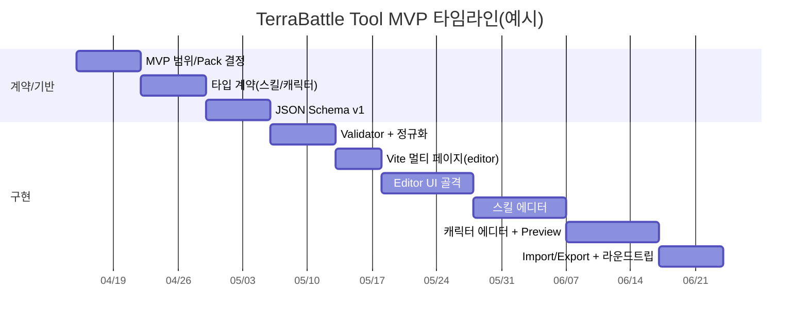
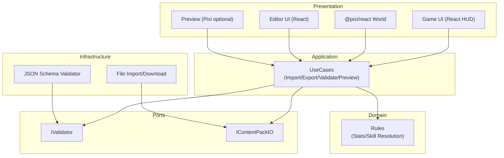

# TerraBattle 저장소 기반 Tool MVP 구현 연구 보고서

## 요약

본 보고서는 **darkbard81/TerraBattle** 저장소의 문서(특히 `Research.md`, `docs/*`, 루트 문서들)를 근거로, **콘텐츠 제작 툴(에디터) MVP**를 구현하기 위한 실무 수준의 설계·계획을 제시합니다. 핵심 방향은 “**React는 화면/폼/워크플로우(UI) + Pixi는 미리보기(캔버스)**”로 역할을 분리하고, 게임 런타임과 툴이 **동일한 데이터 계약(Types + JSON Schema)과 검증기**를 공유하도록 구조화하는 것입니다. fileciteturn3file0 fileciteturn12file0 fileciteturn15file0

저장소의 현재 상태는 Vite 기반 웹앱으로 **Title 화면(React HUD + Pixi 배경)**까지 구현되어 있으며, 전역 상태는 `useReducer` 기반의 단순 `GameState`로 시작한 단계입니다. fileciteturn12file0 fileciteturn28file0 fileciteturn36file0 fileciteturn34file0

Tool MVP는 곧바로 “맵/다이얼로그/전투”까지 욕심내기보다, 이미 문서로 규칙이 비교적 명확한 영역(스킬, 성장/스탯 계산)을 중심으로 **스킬/캐릭터 편집 + 검증 + Import/Export**까지를 1차 목표로 삼는 것이 리스크가 낮습니다. 이때 스키마 버전/마이그레이션, 참조 무결성(예: 캐릭터가 참조하는 스킬 ID 존재 여부) 같은 “데이터 계약”을 먼저 고정하는 것이 장기적으로 가장 큰 비용 절감을 만듭니다. fileciteturn16file0 fileciteturn17file0 fileciteturn3file0

---

## 저장소 관찰과 핵심 근거

이 저장소는 entity["company","GitHub","code hosting platform"] 에서 공개 관리되며, 런타임은 **Vite + React + TypeScript + PixiJS + @pixi/react** 조합입니다. 버전·엔진 제약은 `package.json`에 명시되어 있고, Node 엔진은 `^20.19.0 || >=22.12.0` 입니다. fileciteturn20file0

### 문서·규칙의 “단일 진실원”으로 취급해야 할 파일들

아래 목록은 Tool MVP 설계에 직접 영향을 주는 “근거 문서/루트 문서”입니다.

| 범주 | 파일 경로 | 핵심 내용 | Tool MVP에 미치는 영향 |
|---|---|---|---|
| 개발 종합 지침(리서치) | `Research.md` | 콘텐츠 툴/SaveData/아키텍처 방향을 한 문서로 종합 | “툴+런타임 데이터 계약 공유”를 최우선으로 강제 fileciteturn3file0 |
| 저장소 개요/실행 | `README.md` | 현재 스택, 문서 링크, 명령어, 구현 범위(Title) | MVP 범위·실행/검증 루틴 기준 fileciteturn12file0 |
| 에이전트/코딩 규칙 | `AGENTS.md` | 도메인/표현 분리, ESM-only, class/interface 선호, TSDoc(한국어) | 툴 코드 구조·작성 규칙의 강제 조건 fileciteturn19file0 |
| 로드맵 | `RoadMap.md` | Foundation→Schema→Tooling→Battle→Save 요약 | Tool 이전에 Schema를 고정해야 하는 근거 fileciteturn18file0 |
| 핵심 조작/전투 정의 | `docs/core_definition.md` | “경계 통과 기반 조작”, move/swap/block, 샌드위치 공격 | (후속) 맵/전투/미리보기 구현 시 도메인 규칙의 기준 fileciteturn13file0 |
| 해상도/레이아웃 규칙 | `docs/resolution_rule.md` + `src/shared/constants/display.ts` | 1080×1920 가상해상도, 앵커/세이프에어리어 | (후속) 에디터 UI/캔버스 스케일 정책에 영향 fileciteturn14file0 fileciteturn27file0 |
| 아키텍처 규칙 | `docs/architecture.md` | Presentation/Application/Domain/Ports/Infra 레이어 | 툴도 동일 레이어링으로 “공유 도메인/검증기” 만들기 fileciteturn15file0 |
| 스킬 데이터 최소 규약 | `docs/skill_core_structure.md` | 스킬 필드, 타입, 슬롯 발동 순서 규칙 | **Tool MVP 최상위 편집 대상**(스킬) fileciteturn16file0 |
| 성장/스탯·전투 계산 | `docs/battle_grown_rule.md` | 기본능력치=50, 파생치/명중·데미지 공식, 성장방식 | **캐릭터 편집 + 미리보기(계산)** 근거 fileciteturn17file0 |

### 코드 베이스 현황과 “툴 구현”에 유리한 지점

현재 앱은 공통 Pixi 캔버스를 유지한 채(`@pixi/react`의 `<Application resizeTo={window}>`) 장면별 Pixi 레이어를 갈아끼우고, React HUD를 별도 DOM 레이어로 올리는 패턴입니다. 이 패턴은 “에디터도 React UI + Pixi 미리보기”로 확장하기에 적합합니다. fileciteturn28file0

- 전역 상태는 `GameState`/`gameStateReducer`로 단순 시작했으며, 테스트(Vitest)도 이미 존재합니다. fileciteturn33file0 fileciteturn34file0 fileciteturn41file0  
- Pixi 리소스 로딩은 `Assets.load()`를 사용하고 있으며, 이는 Promise 기반 + 캐시를 통해 중복 로드에 안전한 쪽이므로 Tool에서도 동일 접근이 자연스럽습니다. fileciteturn30file0 citeturn13search2  
- CI는 Node 20.19.0 고정으로 typecheck/test/build를 수행하여, Tool 도입 시에도 동일 품질 게이트를 재사용할 수 있습니다. fileciteturn48file0  

---

## Tool MVP 목표와 범위 정의

### Tool MVP의 정의

**Tool MVP(콘텐츠 제작 툴)**은 아래 기능을 “최소 단위로 끝까지” 갖춘 상태를 의미합니다.

1) **스킬 편집**: `docs/skill_core_structure.md`의 “Recommended Minimal Schema”를 충족하는 스킬을 생성/수정/삭제하고 검증할 수 있다. fileciteturn16file0  
2) **캐릭터 편집(최소)**: 기본능력치/성장방식/스킬 슬롯을 편집하고, 파생치·명중률·데미지 같은 계산 결과를 미리보기할 수 있다(문서 공식 기반). fileciteturn17file0 fileciteturn16file0  
3) **검증**: JSON 단위로 구조 검증(스키마) + 참조 무결성(예: 캐릭터가 참조하는 스킬 ID 존재)을 통과해야 Export 가능. (`Research.md`의 “단일한 데이터 포맷/Schema” 방향) fileciteturn3file0  
4) **Import/Export**: 최소 1개 “Pack” 단위로 Import/Export(다운로드/업로드 기반) 가능. Pack의 구체 포맷은 **미지정**(아래 Q/A에서 결정 필요).  

### MVP에 포함/제외 권장 범위

- 포함(권장): **Skills + Characters + Validator + Import/Export + (선택) 텍스트/폼 기반 Preview**  
- 제외(권장): Map 편집(그리드), 대화 노드 에디터, 전투 시뮬레이션, 저장/암호화 등은 **후속**  
  - 근거: 맵/대화는 데이터 모델이 저장소 내에서 아직 “스키마 수준”으로 확정되어 있지 않습니다(문서가 조작/전투 규칙은 주지만, Map/Dialogue 스키마는 미지정). fileciteturn13file0 fileciteturn3file0  

### 툴을 어디에 둘 것인가: 접근 방식 비교

| 접근 | 설명 | 장점 | 단점/리스크 | 권장 |
|---|---|---|---|---|
| 게임 앱 내부 라우트(`/editor`) | 단일 SPA에서 라우팅으로 에디터 화면 제공 | 코드 공유 쉬움 | 런타임 번들 비대화, UX 혼재 | 중 |
| **Vite 멀티 페이지** | `/index.html`(게임), `/editor/index.html`(툴)로 분리 | 빌드/번들 분리, 배포·권한 분리 쉬움 | 설정/엔트리 증가 | **상** |
| 별도 데스크톱 앱(Electron 등) | 툴을 완전히 분리 | 파일 접근 편함 | 배포 비용↑, 범위·의존성↑ | (MVP) 낮 |

Vite는 멀티 페이지 구성을 공식 문서에서 안내하며, `build.rollupOptions.input`(또는 최신 문서 맥락에서 Rolldown 옵션)으로 여러 `.html` 엔트리를 지정하는 패턴이 제시됩니다. citeturn9view0

### 에디터 UI 레이아웃 권고

`Research.md`에서 추천하는 패턴은 “좌측 트리 + 중앙 미리보기 캔버스 + 우측 Inspector + 하단 Validation/Console”이며, MVP는 중앙 Pixi 캔버스가 없어도(또는 텍스트 Preview로 대체해도) 성립하지만, 중장기적으로는 Pixi Preview가 가장 큰 레버리지입니다. fileciteturn3file0

image_group{"layout":"carousel","aspect_ratio":"16:9","query":["2D tile map editor UI inspector","game skill editor inspector panel UI","dialogue node graph editor UI","level editor UI sidebar inspector"],"num_per_query":1}

---

## Tool MVP 단계별 구현 계획

아래 계획은 “툴 MVP”를 목표로 하되, **스키마/검증기(데이터 계약)**를 먼저 확정하고 UI를 얹는 순서로 구성했습니다. (노력 추정은 low/medium/high 3단계)

| 단계 | 주요 작업 | 산출물 | 노력 | 의존성 | 주요 리스크 | 수용 기준(acceptance) |
|---|---|---|---|---|---|---|
| 기반 정리 | Tool MVP 범위·Pack 포맷·ID 규칙 결정을 문서화(결정값이 없으면 “미지정”으로 남김) | `docs/tool_mvp_scope.md`(신규, 또는 `Research.md` 보완) | low | 없음 | 범위가 계속 늘어남 | “스킬/캐릭터만” 포함 여부, Pack 포맷이 문서에 명시됨 |
| 타입 계약 확정 | `SkillDef`/`CharacterDef` TS 타입 정의(문서 기반) | `src/content/types/*.types.ts` | medium | `docs/skill_core_structure.md`, `docs/battle_grown_rule.md` | 캐릭터 스키마 미정 항목 누락 | 스킬 타입이 문서의 최소 필드 전부 포함 fileciteturn16file0 |
| JSON Schema v1 | JSON Schema(2020-12)로 Skill/Character 스키마 작성 | `src/content/schema/*.schema.json` | medium | 타입 계약 | 스키마-타입 불일치 | 스키마가 2020-12 메타스키마 기반이며, 샘플 JSON을 통과 |
| Validator/정규화 | 스키마 검증 실행(라이브러리/구현 선택) + Export 시 canonical JSON | `src/content/validate/*`, `src/content/serialize/*` | medium | Schema v1 | canonicalization 규칙 미정 | Export 파일이 동일 입력에 대해 안정적(diff-friendly)이며 검증이 선행됨 |
| Vite 멀티 페이지 | `editor/index.html` + `src/editor/main.ts` 추가, 빌드 입력 분리 | `vite.config.js` 수정, `/editor/` 진입 | medium | 기반 정리 | 라우팅/정적 경로 혼선 | dev에서 `/editor/` 로 접근 가능, build 결과에 editor HTML 포함 citeturn9view0 |
| Editor UI 골격 | 좌측 목록/선택, 우측 폼, 하단 Validation 패널(React) | `src/tools/editor/*`(또는 `src/editor/*`) | high | 멀티 페이지 | 상태관리 복잡도↑ | 스킬 목록/상세 편집이 가능하며 validation 결과가 즉시 표시 |
| 스킬 에디터 완성 | 스킬 필드 입력 UX(효과 타입별 조건부 폼), 슬롯 규칙 가이드 | Skill Editor MVP 화면 | high | Schema/Validator | 문서 규칙 누락 | 문서의 “Skill Resolution Rules”를 UI가 위반하지 않게 보조 fileciteturn16file0 |
| 캐릭터 에디터 완성 | 기본능력치/성장방식/스킬 장착 + 파생치/명중·데미지 Preview | Character Editor MVP 화면 | high | 성장 공식/스킬 참조 | 성장 계산 실수 | 파생치/명중률/데미지 계산이 문서 수식과 일치 fileciteturn17file0 |
| Import/Export | Pack 단위 Import/Export(파일 업/다운) + 참조 무결성 검사 | Import/Export UX + e2e 테스트(최소) | medium | Editor 화면 | 브라우저 파일 API 제약 | Export→Import 라운드트립이 손실 없이 동일 데이터 재현 |

Vitest는 Vite 기반 테스트 러너이며, 프로젝트에 `test: "vitest"`, `test:run: "vitest run"` 스크립트를 두는 패턴이 공식 가이드에서 제시됩니다. 이 저장소는 이미 해당 스크립트/테스트 예제를 갖추고 있어(Foundation 비용이 낮음) Tool 코드에도 동일한 품질 게이트를 적용하기 좋습니다. fileciteturn20file0 fileciteturn41file0 citeturn13search1

### Tool MVP 타임라인 예시

아래는 “주 단위” 예시이며 팀 규모/우선순위가 **미지정**이므로 날짜는 참고용입니다.



---

## 필수 기술 정의, 인터페이스, 데이터 모델, 설정

이 섹션은 “구현에 바로 들어가기 위한 최소 설계”만 제시합니다. 저장소의 원칙(ESM-only, 도메인/표현 분리, class/interface 선호, TSDoc 한국어)은 강제 조건입니다. fileciteturn19file0 fileciteturn15file0

### 핵심 용어 정의

- **Content Pack**: 스킬/캐릭터 등 콘텐츠 JSON 묶음. 저장·배포 단위는 **미지정**(단일 JSON vs 여러 파일 디렉터리 vs zip). fileciteturn3file0  
- **Schema v1**: JSON 구조를 검증하는 JSON Schema(2020-12 기반). JSON Schema는 Core/Validation 문서로 분리된 표준이며, 최신 메타스키마가 2020-12임이 명시됩니다. citeturn10search0turn10search5  
- **Canonical JSON**: Export 시 키 정렬/공백/배열 규칙을 고정해 Git diff 안정성을 확보하는 직렬화 규칙. 구체 규칙은 **미지정**이나, “항상 같은 입력→같은 출력”을 목표로 해야 합니다. fileciteturn3file0  
- **참조 무결성(Referential Integrity)**: 캐릭터가 참조하는 `skillId`가 스킬 목록에 존재하는지 등, 스키마 밖의 관계 제약.

### 데이터 모델(초안)

#### SkillDef (문서 기반)

아래 필드들은 `docs/skill_core_structure.md`의 최소 스키마에 근거합니다. fileciteturn16file0

```ts
// src/content/types/Skill.types.ts
export type StatId = "STR" | "VIT" | "DEX" | "AGI" | "AVD" | "INT" | "MND" | "RES" | "LUK";
export type SkillEffectType = "damage" | "buff" | "debuff" | "heal";
export type SkillAttackType = "physical" | "magical" | "auto";
export type TargetSide = "self" | "ally" | "enemy";

export interface SkillCompositeHit {
  readonly attack_type: Exclude<SkillAttackType, "auto">;
  readonly source_stat: StatId;
  readonly multiplier: number;
  readonly hit_count: number;
}

export interface SkillDef {
  readonly id: string;
  readonly name: string;
  readonly replaceable: boolean;
  readonly proc_chance: number; // 1~100
  readonly effect_type: SkillEffectType;
  readonly attack_type: SkillAttackType;
  readonly target_side: TargetSide;
  readonly source_stat: StatId;
  readonly affected_stat: StatId | null;
  readonly multiplier: number;
  readonly hit_count: number;
  readonly duration_turns?: number;
  readonly composite_hits?: readonly SkillCompositeHit[] | null;
  readonly description?: string;
}
```

#### CharacterDef (문서 기반 + 미지정 포함)

캐릭터 스키마는 저장소 내에서 “완성된 문서”로 존재하지 않으므로, Tool MVP를 위해 다음 최소 구조를 제안합니다.

- 기본능력치 초기 50, 파생치/명중·데미지 공식, 성장방식 추천안은 `docs/battle_grown_rule.md`에 근거합니다. fileciteturn17file0  
- 스킬 슬롯 규칙(4 슬롯, 1번 슬롯 100%/교체 불가, 순차 판정)은 `docs/skill_core_structure.md`에 근거합니다. fileciteturn16file0  
- “직업/클래스/무기/속성/애니메이션” 등은 **미지정**입니다.

```ts
// src/content/types/Character.types.ts
import type { StatId } from "./Skill.types.js";

export type GrowthType = "Power" | "Technique" | "Arcane" | "Ward" | "Balanced";

export interface BaseStats {
  readonly STR: number;
  readonly VIT: number;
  readonly DEX: number;
  readonly AGI: number;
  readonly AVD: number;
  readonly INT: number;
  readonly MND: number;
  readonly RES: number;
  readonly LUK: number; // 성장 제외 규칙 존재 fileciteturn17file0
}

export interface SkillSlot {
  readonly slotIndex: 1 | 2 | 3 | 4;
  readonly skillId: string;
}

export interface CharacterDef {
  readonly id: string;
  readonly name: string;

  readonly level: number;            // MVP에서는 1~(미지정)
  readonly growthType: GrowthType;

  readonly baseStats: BaseStats;     // level 1 기본 50 규칙 fileciteturn17file0
  readonly maxHpBase: number;         // level 1 기본값 50 규칙 fileciteturn17file0

  readonly skillSlots: readonly SkillSlot[]; // 4 슬롯 규칙 fileciteturn16file0

  // 이후 확장(미지정):
  // readonly portraitId?: string;
  // readonly tags?: readonly string[];
}
```

### 계산/미리보기(Preview) 규약

Tool MVP의 “미리보기”는 도메인 로직으로 분리되어 테스트 가능해야 합니다(아키텍처 문서 + AGENTS 규칙). fileciteturn15file0 fileciteturn19file0

- 파생치 계산: `PATK, PDEF, MATK, ...` 등 공식은 `docs/battle_grown_rule.md`에 명시되어 있습니다. fileciteturn17file0  
- 명중률/데미지 계산도 동일 문서의 `FLOOR/MIN/MAX` 규칙을 따라야 합니다. fileciteturn17file0  

### 스키마 검증 방식 비교

| 방식 | 장점 | 단점 | MVP 적합도 |
|---|---|---|---|
| **JSON Schema(2020-12)** | 표준화된 검증/문서화, 툴·런타임 공유 용이, 장기 자산 | 스키마 작성 비용 | **상** citeturn10search0turn10search5 |
| TS 타입만 사용 | 개발 속도 빠름 | 런타임 검증 부재(Import 시 취약), JSON 계약이 문서로 남지 않음 | 중 |
| Zod 등 런타임 스키마 | TS 친화적 | “표준 스키마”로 외부 공유 시 변환 필요 | 중 |

저장소의 `Research.md`가 “JSON + Schema”를 일관 포맷으로 강조하고 있으므로, MVP부터 JSON Schema를 채택하는 편이 저장소 방향성과 일치합니다. fileciteturn3file0 citeturn10search0turn10search5

### Vite 멀티 페이지 설정(게임/툴 분리)

현재 `index.html`은 `/src/main.ts`를 엔트리로 사용합니다. fileciteturn39file0  
Tool을 멀티 페이지로 분리하려면 `editor/index.html`을 추가하고, `vite.config.js`의 build 입력을 다중 `.html`로 지정합니다. Vite 한국어 문서의 “Multi-Page App” 섹션은 이를 `build.rollupOptions.input`으로 설명합니다. citeturn9view0

(예시 구상 — 실제 파일명/경로는 팀 결정값에 따라 조정, 현재는 **미지정**)

```js
// vite.config.js (예시 개념)
import { defineConfig } from "vite";
import react from "@vitejs/plugin-react";
import { resolve } from "node:path";

export default defineConfig({
  plugins: [react()],
  build: {
    rollupOptions: {
      input: {
        main: resolve(__dirname, "index.html"),
        editor: resolve(__dirname, "editor/index.html"),
      },
    },
  },
});
```

### Pixi/React 통합과 리소스 로딩

- 런타임은 `@pixi/react`의 `<Application resizeTo={window}>`를 사용 중이며, 공식 문서에서 `resizeTo`가 HTML element 또는 React ref를 받을 수 있음을 명시합니다. 에디터는 이 특성을 활용해 “캔버스 컨테이너”를 기준으로 리사이즈하게 만들 수 있습니다. fileciteturn28file0 citeturn13search3  
- PixiJS `Assets`는 Promise 기반 로딩/캐싱을 제공하며 문서에서 “cache-aware”를 명시합니다. 현재 타이틀 배경도 `Assets.load()`로 로드 중이므로, 에디터에서도 동일 패턴(캐시 활용)을 재사용하는 것이 자연스럽습니다. fileciteturn30file0 citeturn13search2  

### (후속 확장) 저장/전역변수 관련 기술 근거

Tool MVP 범위 밖이지만, `Research.md`가 SaveData와 전역변수 설계를 강하게 요구합니다. 저장 방식에서 Web Storage(localStorage/sessionStorage)와 IndexedDB의 특성 차이는 공식 문서에서 설명됩니다.

- Web Storage(localStorage/sessionStorage)는 동기(synchronous) 동작이며, 대용량/빈번 접근 시 성능 리스크가 있습니다. citeturn12search0  
- IndexedDB는 대용량 구조화 데이터에 적합하고, 작업이 비동기(asynchronous)로 수행됨이 명시됩니다. citeturn6search3turn6search4  
- 저장소 영속성(persistent storage) 요청은 `StorageManager.persist()`로 가능하며, 브라우저가 요청을 수용할 수도/안 할 수도 있음을 문서에서 명시합니다. citeturn10search2  
- WebCrypto의 `SubtleCrypto`는 `sign/verify`, `encrypt/decrypt`를 제공하고, secure context(HTTPS)에서만 동작하는 제약이 문서에 명시됩니다. citeturn5search5turn5search1turn5search2turn5search3turn5search4  

이 보고서에서는 위 내용을 “에디터 MVP 완료 이후”의 설계 리스크로만 기록하고, 구체 저장 스펙은 Q/A에서 결정하도록 남깁니다(미지정).

### 전체 아키텍처 개요(툴+런타임 공용화)

아키텍처 문서의 레이어링(Presentation/Application/Domain/Ports/Infra)을 툴에도 그대로 적용하면, 도메인 규칙과 검증기가 런타임·툴에서 공용화되어 중복 구현을 줄일 수 있습니다. fileciteturn15file0



---

## 결정이 필요한 질문

아래 Q/A는 “미지정”인 구현 결정을 확정하기 위해 필요합니다. 답변이 없으면 Tool MVP 설계를 확정할 수 없거나, 불필요한 재작업 위험이 커집니다.

### Q. Content Pack의 실제 포맷은 무엇인가요?

- A. (2) `skills.json`, `characters.json` 분리(권장)  

### Q. ID 규칙(네이밍/불변성/충돌 방지)은 어떻게 하나요?

- A. 사람이 정하는 slug 

### Q. CharacterDef에서 “게임에 반드시 필요한 필드”는 무엇인가요?

- A. MVP는 성장/스탯/스킬/이미지경로/타일width,height,x,y/슬롯 위주로 최소화

### Q. 캐릭터 스탯 편집 정책은 무엇인가요?

- A. 1레벨 기본 50, 수동 편집 허용

### Q. 스킬/캐릭터 “미리보기”의 목표 수준은 어디까지인가요?

- A. 계산식 기반 수치 미리보기만(권장 MVP)  

### Q. 에디터 결과물을 런타임에서 어떻게 로드할 계획인가요?

- A. 번들에 포함(`src/content/packs/*`)  

### Q. (후속) SaveData/전역변수에서 무결성(서명)·암호화·저장소는 어디까지 적용하나요?

- A. Clinet에 저장만 되면 됨 base64 encoding만 적용.

### Q. UI/UX 참고 자료(와이어프레임/데이터 샘플)를 제공할 수 있나요?

- A. (1) 스킬/캐릭터 샘플 JSON 3~5개 = docs/character_core_structure.md, docs/skill_core_structure.md
     (2) 미지정
     (3) 스킬 - 캐릭터 - Import/Export
