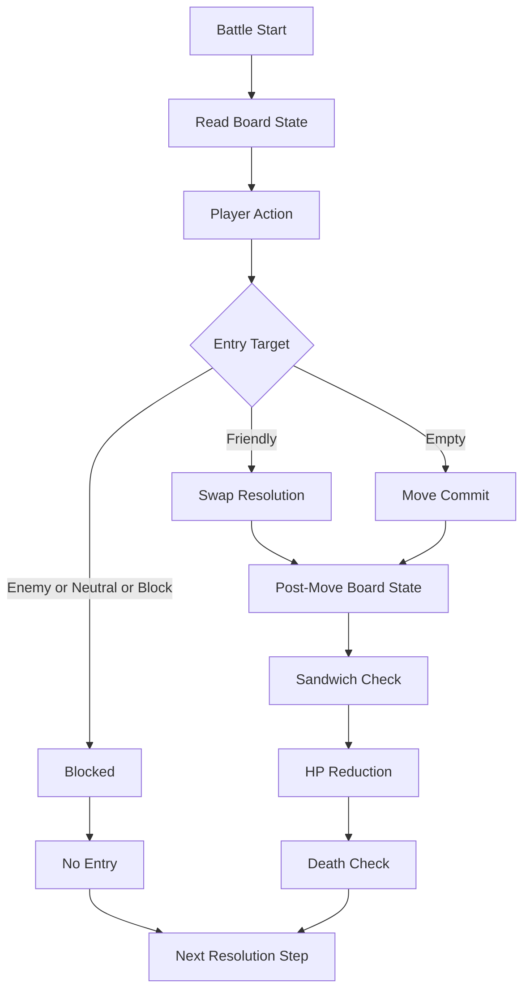

# Battle Rules

## 1. Overview

TerraBattle battle is a puzzle-style sandwich combat played on a grid board.
The grid may be a default `8x8` board or another freely defined rectangular grid size.

Friendly tiles, enemy tiles, neutral tiles, and block tiles exist on the grid.
Grid cells also have terrain types. The default terrain is normal terrain, and some cells may use environmental terrain such as trap tiles.

Detailed stats and abilities for each tile or unit are defined separately, but combat resolution ultimately reduces HP and a unit dies when its HP reaches the death threshold.

## 2. Board Structure

### 2.1 Grid

- A battle takes place on a rectangular grid.
- The default board size is `8x8`.
- Other board sizes are allowed if defined by scenario or battle data.

### 2.2 Occupants

The following occupant categories may exist on the board.

- `friendly`
- `enemy`
- `neutral`
- `block`

### 2.3 Terrain

Each grid cell has a terrain type.

- Default terrain type is `normal`.
- Special environment terrain such as `trap` may exist.
- Terrain effects are resolved by separate terrain or hazard rules.

## 3. Tile Occupancy and Entry Rules

### 3.1 Default Block Rule

By default, the following occupant categories are blocking targets for movement entry.

- `enemy`
- `neutral`
- `block`

A moving friendly tile cannot directly enter a cell occupied by those targets through normal movement.

### 3.2 Friendly Swap Rule

A friendly tile is not handled as a default block target.
When a moving friendly tile attempts to enter a cell occupied by another friendly tile, the two friendly tiles perform a `swap`.

### 3.3 Swap Direction Rule

The swap is resolved using the movement entry direction and its reverse direction.
The entered friendly tile moves to the reverse direction relative to the entering movement.

For example:

- If a unit enters from left to right into another friendly tile, the entered friendly tile moves toward the left side as part of the swap resolution.
- If a unit enters from top to bottom into another friendly tile, the entered friendly tile moves toward the top side as part of the swap resolution.

Detailed swap constraints are defined in implementation-level movement rules.

## 4. Core Combat Rule

### 4.1 Sandwich Attack Principle

The core attack rule is a sandwich attack.
An enemy is defeated by being caught between valid opposing sides according to sandwich conditions.

### 4.2 Orthogonal Sandwich

The default sandwich rule uses orthogonal directions on the grid.
A sandwich is formed when the target enemy is enclosed from two opposing sides along a valid line.

Example directions:

- left and right
- up and down

Detailed detection order and multi-target resolution are defined separately if needed.

### 4.3 Corner Sandwich

If an enemy is located in a corner, the corner itself may be used as one side of the sandwich.
In that case, blocking the enemy against the corner satisfies the sandwich attack condition.

This means the board corner can function as a valid enclosure side for corner enemies.

## 5. Damage and Death

### 5.1 HP-Based Resolution

Each unit or tile entity may have its own separately defined abilities and stats.
However, the result of attack resolution is ultimately expressed as HP reduction.

### 5.2 Death Rule

- When HP is reduced to the death threshold, the target dies.
- The default death threshold is not fixed in this document and is defined in unit rules or stat rules.
- Death handling removes or deactivates the defeated entity according to separate entity lifecycle rules.

## 6. Environment and Hazard Notes

- The board may contain non-normal terrain such as trap cells.
- Terrain effects are part of battle resolution, but exact trigger timing and resolution order are not fixed in this document.
- Terrain and hazard details must be defined in a separate document if they affect movement, damage, or death.

## 7. Fixed Decisions

- Battles are played on a grid board.
- Default grid size is `8x8`, but other grid sizes are allowed.
- Occupant categories include friendly, enemy, neutral, and block.
- Grid cells have terrain, with `normal` as the default terrain.
- Environmental terrain such as trap cells may exist.
- Enemy, neutral, and block occupants are blocking targets by default.
- Friendly-to-friendly entry resolves as swap.
- Swap direction uses the entry direction and reverse direction.
- The core attack rule is sandwich attack.
- Orthogonal sandwich is the default rule basis.
- Corner enemies can be defeated by using the corner as one side of the sandwich.
- Detailed abilities are defined separately, but combat outcome is resolved through HP reduction and death.

## 8. Open Items

- Exact movement unit: one tile per action or another rule.
- Whether neutral tiles can ever move or react.
- Whether block tiles are immutable or can be destroyed.
- Exact sandwich trigger timing: on move commit, after swap, or another timing.
- Whether friendly units can be damaged or defeated by the same sandwich or terrain rules.
- Exact trap timing and resolution order.
- Exact death threshold and removal timing.
- Whether sandwich resolution supports multi-kill in one move.
- Whether diagonal sandwich is disallowed explicitly.

## 9. Battle Loop Summary

## 10. Notes

This document defines the top-level battle rule frame only.
Detailed movement rules, swap constraints, terrain timing, unit stats, and damage formulas must be defined in separate documents.
