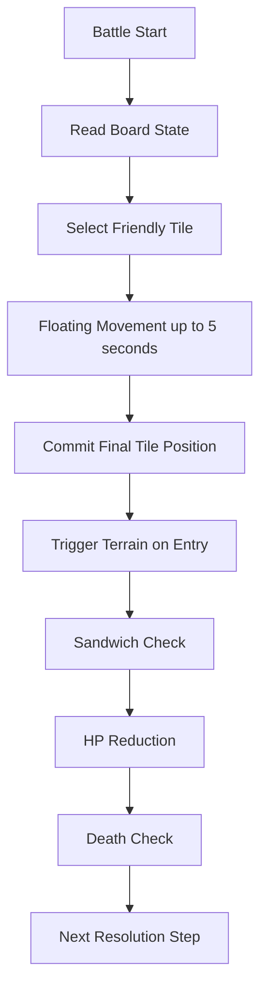

# Battle Rules

## 1. Overview

TerraBattle battle is a puzzle-style sandwich combat played on a grid board.
The grid may be a default `8x8` board or another freely defined rectangular grid size.

Friendly tiles, enemy tiles, neutral tiles, and block tiles exist on the grid.
Grid cells also have terrain types. The default terrain is normal terrain, and some cells may use environmental terrain such as trap tiles.

Detailed stats and abilities for each tile or unit are defined separately, but combat resolution ultimately reduces HP and a unit dies when its HP reaches the death threshold.

## 2. Board Structure

### 2.1 Grid

- A battle takes place on a rectangular grid.
- The default board size is `8x8`.
- Other board sizes are allowed if defined by scenario or battle data.

### 2.2 Occupants

The following occupant categories may exist on the board.

- `friendly`
- `enemy`
- `neutral`
- `block`

### 2.3 Terrain

Each grid cell has a terrain type.

- Default terrain type is `normal`.
- Special environment terrain such as `trap` may exist.
- Terrain effects are resolved by separate terrain or hazard rules.
- Terrain or hazard effects trigger whenever a tile enters that cell.

## 3. Tile Occupancy and Entry Rules

### 3.1 Default Block Rule

By default, the following occupant categories are blocking targets for movement entry.

- `enemy`
- `neutral`
- `block`

A moving friendly tile cannot directly enter a cell occupied by those targets through normal movement.

### 3.2 Friendly Swap Rule

A friendly tile is not handled as a default block target.
When a moving friendly tile attempts to enter a cell occupied by another friendly tile, the two friendly tiles perform a `swap`.

### 3.3 Swap Direction Rule

Swap is allowed in orthogonal directions and diagonal directions.
Detailed swap constraints are defined in the movement rules document.

### 3.4 Block Durability Rule

- `block` occupants are immutable and cannot be destroyed.
- If a design requires a destructible obstacle, that object must be modeled as an `enemy`, not as a `block`.

### 3.5 Enemy and Neutral Movement

- Enemy movement AI is defined separately.
- Neutral movement or reaction AI is defined separately.
- This document does not assume that enemy or neutral occupants are static forever.

## 4. Core Combat Rule

### 4.1 Sandwich Attack Principle

The core attack rule is a sandwich attack.
An enemy is defeated by being caught between valid opposing sides according to sandwich conditions.
Only sandwiched enemies are valid sandwich targets.

### 4.2 Orthogonal Sandwich

The default sandwich rule uses orthogonal directions on the grid.
A sandwich is formed when the target enemy is enclosed from two opposing sides along a valid line.

Example directions:

- left and right
- up and down

### 4.3 Diagonal Sandwich

Diagonal sandwich is not allowed.
Diagonal adjacency by itself does not satisfy sandwich attack conditions.

### 4.4 Corner Sandwich

If an enemy is located in a board corner, the corner itself may be used as one side of the sandwich.
This is a corner-specific exception rule and is not treated as diagonal sandwich.
The board corner functions as a valid fixed enclosure side for that corner enemy.

### 4.5 Sandwich Trigger Timing

Sandwich resolution is checked after the selected friendly tile stops and its final tile position is committed.
A temporary floating path during the time limit does not by itself trigger sandwich resolution.

## 5. Damage and Death

### 5.1 HP-Based Resolution

Each unit or tile entity may have its own separately defined abilities and stats.
However, the result of attack resolution is ultimately expressed as HP reduction.

### 5.2 Death Rule

- When HP is reduced to the death threshold, the target dies.
- Death handling removes or deactivates the defeated entity according to separate entity lifecycle rules.

## 6. Environment and Hazard Notes

- The board may contain non-normal terrain such as trap cells.
- Terrain effects trigger whenever a tile enters the corresponding terrain cell.
- Terrain and hazard details must be defined in a separate document if they affect movement, damage, or death.

## 7. Fixed Decisions

- Battles are played on a grid board.
- Default grid size is `8x8`, but other grid sizes are allowed.
- Occupant categories include friendly, enemy, neutral, and block.
- Grid cells have terrain, with `normal` as the default terrain.
- Environmental terrain such as trap cells may exist.
- Terrain effects trigger on tile entry.
- Enemy, neutral, and block occupants are blocking targets by default.
- Friendly-to-friendly entry resolves as swap.
- Swap is allowed in orthogonal and diagonal directions.
- `block` occupants are immutable and cannot be destroyed.
- Destructible obstacles must be modeled as `enemy` if needed.
- Enemy and neutral movement or reaction behavior is defined separately.
- The core attack rule is sandwich attack.
- Only sandwiched enemies are valid sandwich targets.
- Orthogonal sandwich is the default rule basis.
- Diagonal sandwich is not allowed.
- Corner enemies can be defeated by using the corner as one side of the sandwich.
- Corner sandwich is a special corner rule, not diagonal sandwich.
- Sandwich resolution happens after final move commit.
- Detailed abilities are defined separately, but combat outcome is resolved through HP reduction and death.

## 8. Open Items

- Whether friendly units can be damaged or defeated by the same sandwich or terrain rules.
- Exact death threshold and removal timing.
- Whether sandwich resolution supports multi-kill in one move.

## 9. Battle Loop Summary

## 10. Notes

This document defines the top-level battle rule frame only.
Detailed movement rules, terrain timing details, unit stats, and damage formulas must be defined in separate documents.
