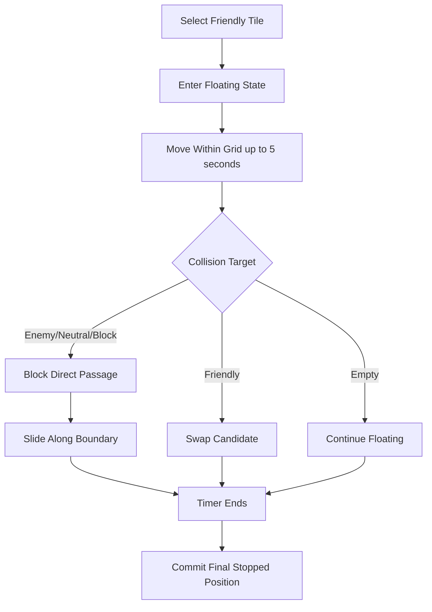

# Movement Rules

## 1. Overview

This document defines friendly tile floating movement during battle.
A selected friendly tile enters a temporary floating state and moves across the grid within a time limit.
The final stopped position is then committed as the actual movement result.

## 2. Floating Movement

### 2.1 Selected Friendly Tile

- A selected friendly tile enters a floating state.
- The floating tile can move freely across the grid map during the active movement window.
- Movement is restricted to positions inside the grid map.

### 2.2 Time Limit

- The floating movement time limit is `5s`.
- When `5s` expires, the tile stops.
- The tile position at the stop moment is used as the committed final position for movement resolution.

## 3. Grid Boundary Rule

- Movement is allowed only inside the grid map.
- The floating tile cannot move outside the board boundary.
- Board edges act as hard movement limits.

## 4. Blocking and Sliding

### 4.1 Blocking Targets

During floating movement, the following occupant categories are blocking targets.

- `enemy`
- `neutral`
- `block`

### 4.2 Collision With Blocking Targets

- A floating friendly tile cannot pass through a blocking target.
- On contact with a blocking target, the blocked direction is denied.

### 4.3 Boundary Sliding

- Even when a blocking target prevents direct passage, the floating tile may continue moving along the boundary of that blocking target during the same time window.
- This is treated as sliding along the blocking edge rather than passing through the blocked tile.
- Sliding must still remain inside the grid map.

## 5. Friendly Swap

### 5.1 Swap Target

- Entering another friendly tile does not count as blocked movement.
- Instead, the movement resolves as `swap`.

### 5.2 Allowed Swap Directions

Swap is allowed in all adjacent directions.

- up
- down
- left
- right
- diagonal adjacent positions

This means swap can occur in orthogonal or diagonal adjacency if the final committed movement path enters that friendly position.

## 6. Movement Commit

### 6.1 Commit Timing

- Floating movement is temporary.
- Actual board movement is not finalized continuously during floating movement.
- Movement is finalized only when the movement timer ends and the stopped tile position is committed.

### 6.2 Commit Result

After commit:

- final tile position is fixed
- swap resolution is applied if the committed position is a friendly tile entry
- terrain entry effects are triggered on the committed entered cell
- sandwich resolution becomes eligible after the committed movement result is finalized

## 7. Fixed Decisions

- The selected friendly tile uses floating movement.
- Floating movement time limit is `5s`.
- Final movement is committed using the stopped position when the timer expires.
- Movement is allowed only within the grid map.
- Enemy, neutral, and block occupants are blocking targets during movement.
- Blocking targets cannot be passed through.
- The floating tile may slide along blocking boundaries during the same movement window.
- Friendly entry resolves as swap.
- Swap is allowed in orthogonal and diagonal adjacent directions.

## 8. Open Items

- Whether the player can release earlier than `5s` to commit immediately.
- Exact pointer-to-grid snapping behavior during floating movement.
- Exact rule for choosing the committed tile when the floating position overlaps multiple candidate cells near a boundary.
- Whether swap can chain multiple times within one floating window before final commit.

## 9. Flow Summary

## 10. Notes

This document defines only floating movement behavior.
Battle result resolution, sandwich detection, terrain damage, and AI behavior are defined in separate documents.
