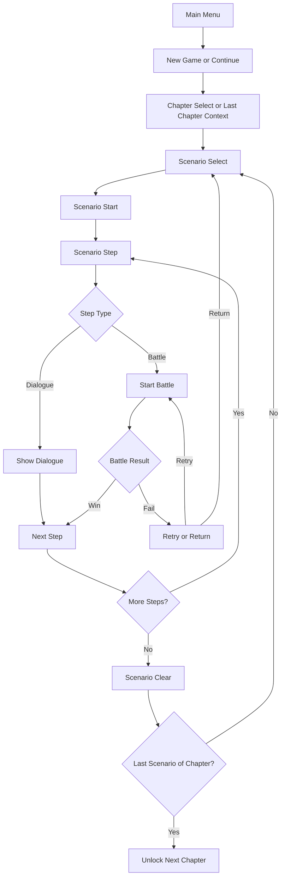

# Game Core Rules

## 1. Overview

TerraBattle is a scenario-based tile sandwich attack puzzle game.

The player starts from the main menu, chooses a chapter and scenario, and progresses through dialogue and battle steps in sequence.
Scenario clear results unlock the next scenario or the next chapter.

## 2. Main Menu

The main menu has the following entries.

- `New Game`
- `Continue`
- `Config`
- `Exit`

### 2.1 New Game

- Starts a new progress state.
- Handling of existing save data is not fixed yet.

### 2.2 Continue

- Continues from saved progress.
- Continue resumes from the last available scenario selection point.
- Battle mid-state resume is not supported.
- Continue enters the last available chapter and then the scenario selection state for that chapter.

### 2.3 Config

- Opens the configuration screen.
- Detailed configuration items are not fixed yet.

### 2.4 Exit

- Exits the game.
- Exact platform-specific exit behavior is not fixed yet.

## 3. Top-Level Progress Structure

### 3.1 Chapter

- The game consists of one or more chapters.
- Each chapter contains one or more scenarios.

### 3.2 Scenario

- The player can select only unlocked scenarios.
- Locked scenarios cannot be selected.
- Scenario unlocks do not branch.
- Scenarios unlock sequentially inside a chapter.

### 3.3 Chapter Unlock

- The next chapter is unlocked when the player clears the last scenario of the current chapter.

## 4. Scenario Progress Rules

### 4.1 Basic Principle

- A scenario is composed of dialogue steps and battle steps.
- Dialogue may exist before a battle, after a battle, both, or neither at a given point.
- A scenario may contain multiple battles.

### 4.2 Step Unit

- The internal unit of scenario progression is `step`.
- A step is a single scenario progression unit.
- A step type is either `dialogue` or `battle`.

### 4.3 Allowed Progress Examples

Examples of valid scenario flows:

- `dialogue -> battle`
- `dialogue -> battle -> dialogue`
- `dialogue -> battle -> dialogue -> battle`
- `battle -> dialogue`
- `battle -> dialogue -> battle`

A scenario is therefore a linear sequence of `step` values.

### 4.4 Battle Entry

- A battle begins when the current scenario step is a battle step.
- Detailed battle rules are defined in a separate battle rules document.

## 5. Result Rules

### 5.1 Victory

- If the player satisfies the victory condition of a battle, that battle step is cleared.
- If the scenario has another step after the current one, progression moves to the next step.
- If the cleared battle was the final required step of the scenario, the scenario is cleared.

### 5.2 Scenario Clear

- Clearing a scenario unlocks the next scenario in the same chapter.
- Clearing the last scenario of a chapter unlocks the next chapter.

### 5.3 Failure

- There is no game over state.
- On battle failure, the player chooses one of the following:
  - `Retry`
  - `Return`
- `Retry` restarts the current battle step.
- `Return` returns to the scenario selection screen.

## 6. Continue and Progress Data

### 6.1 Continue Rule

- Continue is based on the scenario selection point, not the middle of battle execution.
- The game restores the last reachable chapter/scenario selection state.
- Battle mid-progress save and restore are not supported.

### 6.2 Minimum Progress Data

The game must track at least the following:

- unlocked chapters
- unlocked scenarios
- cleared scenarios
- last reachable chapter
- last reachable scenario selection point
- whether continue is available

## 7. Fixed Decisions

- Main menu entries are `New Game`, `Continue`, `Config`, and `Exit`.
- The player selects a chapter and then a scenario.
- Scenario progression is built from `step` units.
- Step types are `dialogue` and `battle`.
- Dialogue can appear before battle, after battle, both, or neither depending on scenario design.
- A scenario may contain multiple battle steps.
- Scenario unlocks are linear and non-branching.
- Chapter unlock is based on clearing the last scenario of the current chapter.
- Battle failure offers `Retry` or `Return`.
- `Return` goes to the scenario selection screen.
- There is no game over state.
- Continue resumes from the last chapter's scenario selection point.
- Continue does not resume a battle mid-state.

## 8. Open Items

- How `New Game` handles existing save data.
- Detailed `Config` items.
- Exact result screen structure after scenario clear.
- Save timing policy outside continue requirements.
- Dialogue UX details such as skip, log, or auto progression.

## 9. Core Loop Summary

## 10. Notes

This document defines only top-level progression rules.
Detailed battle rules, scenario data structure, and progress data structure must be defined in separate documents.
